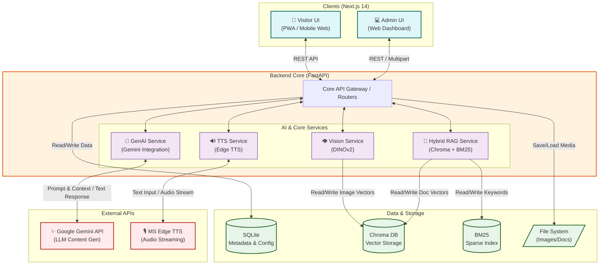
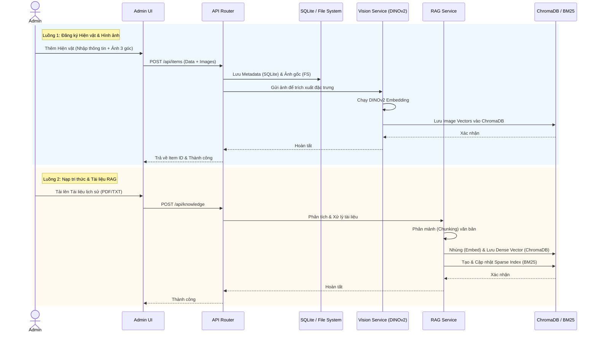
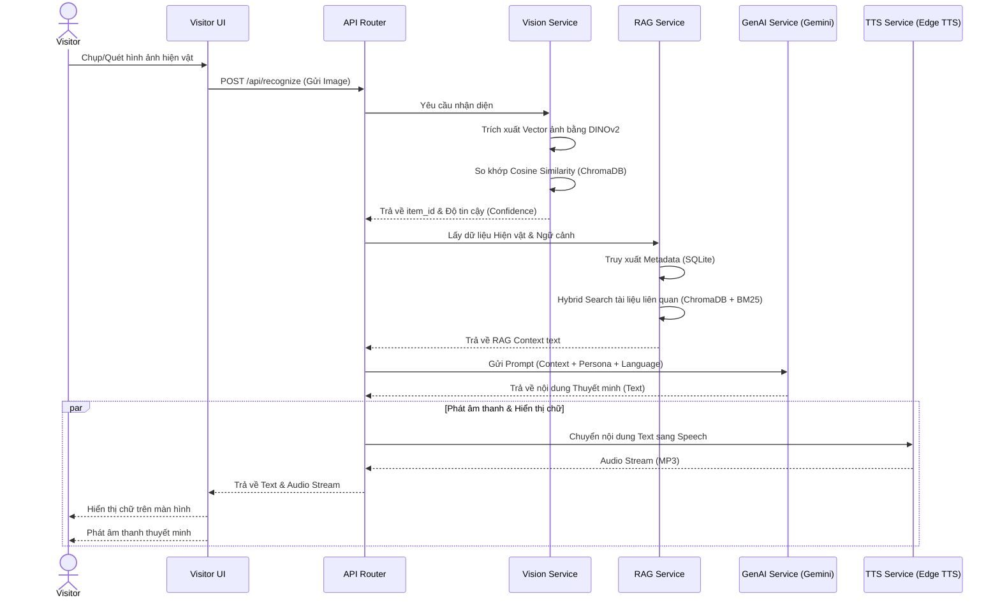

# HERA - Architecture & Data Flow Diagrams

Tài liệu này mô tả chi tiết kiến trúc hệ thống, các thành phần (Components) và luồng dữ liệu (Data Flow) của **HERA - AI Heritage Guide**.

## 1. Sơ đồ Kiến trúc Tổng thể (System Architecture)

Sơ đồ dưới đây thể hiện các thành phần chính của hệ thống, bao gồm Frontend, Backend, các dịch vụ AI nội bộ (Local Services), hệ thống lưu trữ và các API bên ngoài.

---

## 2. Luồng Quản trị (Admin Ingestion Data Flow)

Sơ đồ trình tự (Sequence Diagram) mô tả cách quản trị viên đưa dữ liệu hiện vật và tri thức vào hệ thống, quá trình tạo vector (embedding) để phục vụ cho nhận diện và RAG.

---

## 3. Luồng Trải nghiệm Khách tham quan (Visitor Experience Data Flow)

Sơ đồ trình tự mô tả cách một khách tham quan quét hiện vật bằng điện thoại, hệ thống nhận diện và sinh ra câu chuyện thuyết minh được cá nhân hóa qua giọng nói.

