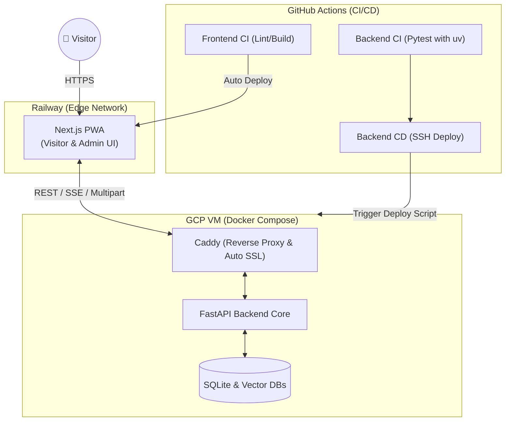
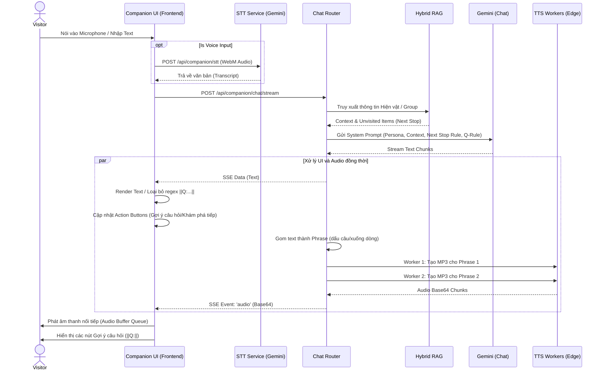
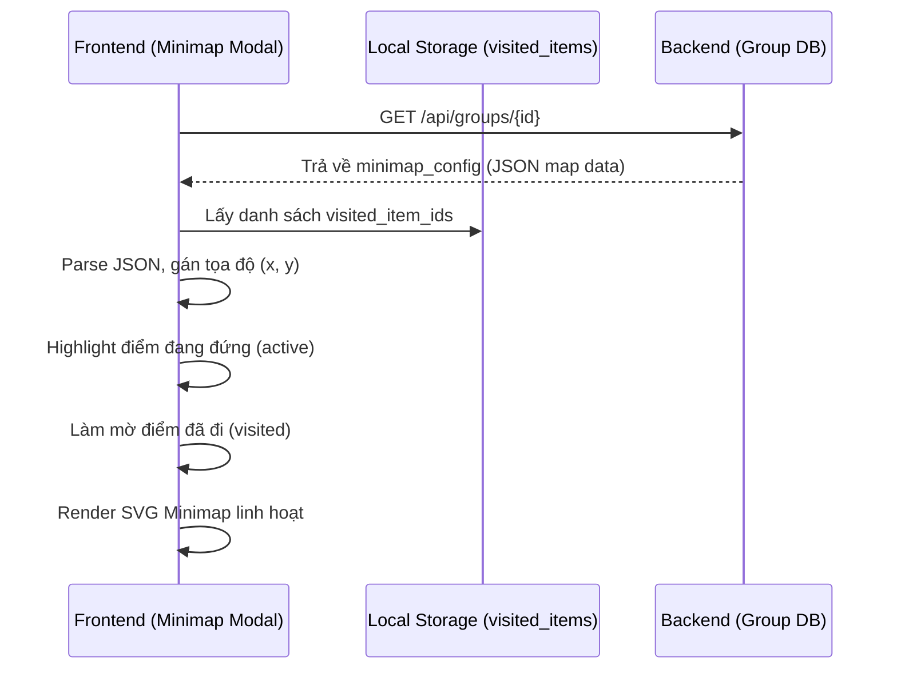

# HERA V3 - Architecture & Streaming Data Flow

Tài liệu này mô tả chi tiết kiến trúc hệ thống V3, đặc biệt tập trung vào việc tách bạch hạ tầng triển khai (CI/CD) và luồng xử lý luồng thời gian thực (Real-time Streaming Data Flow) cực kỳ phức tạp của AI Companion.

## 1. Sơ đồ Kiến trúc Triển khai (Deployment Architecture)

V3 tách biệt hoàn toàn Frontend (Edge/Serverless) và Backend (Cloud VM) được điều khiển tự động qua GitHub Actions.

---

## 2. Luồng Trải nghiệm AI Companion (Streaming Data Flow)

Điểm cốt lõi của V3 là khả năng đàm thoại thời gian thực, sinh UI động từ backend (Backend-driven UI) và tối ưu độ trễ âm thanh bằng cách xé nhỏ văn bản (Chunking).

## 3. Quản lý trạng thái Minimap Động

