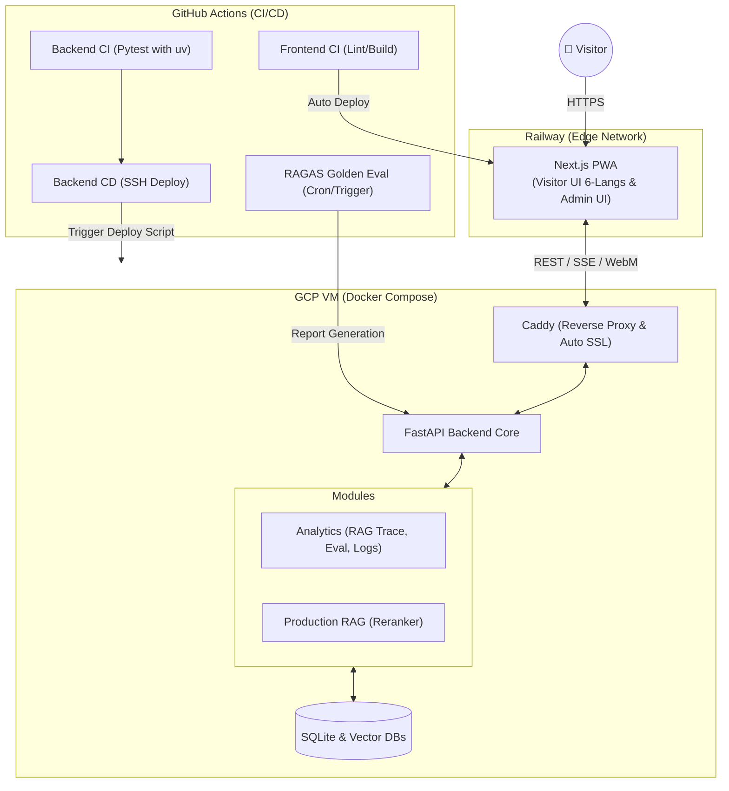
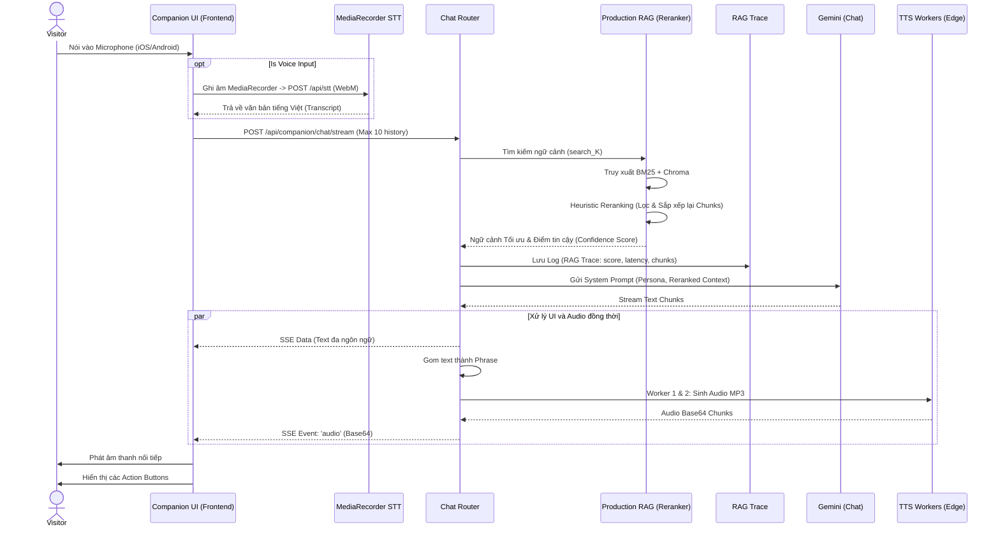
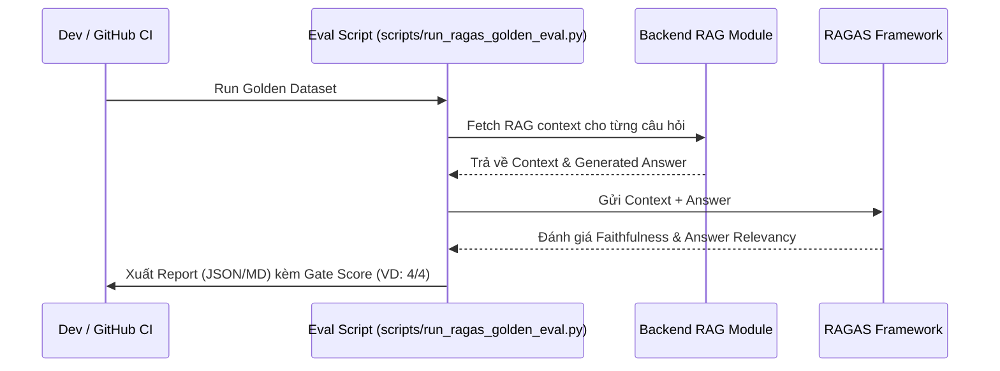

# HERA V4 - Architecture & Production Data Flow

Tài liệu này mô tả chi tiết kiến trúc hệ thống V4, đặc biệt tập trung vào việc bổ sung các luồng đo lường Product Analytics và tối ưu hóa Production RAG với Reranker.

## 1. Sơ đồ Kiến trúc Triển khai & Analytics (Deployment & Analytics Architecture)

V4 bổ sung thêm lớp thu thập dữ liệu Analytics và hệ thống RAGAS Evaluation nội bộ chạy qua GitHub Actions.

---

## 2. Luồng Trải nghiệm AI Companion & RAG V4 (Streaming & RAG Flow)

Điểm khác biệt của V4 là sự xuất hiện của module Reranker và việc lưu trữ RAG Trace để Audit dữ liệu. Âm thanh đầu vào được thu bằng MediaRecorder gửi lên backend dưới dạng file (WebM).

## 3. Hệ thống RAGAS Evaluation Pipeline

