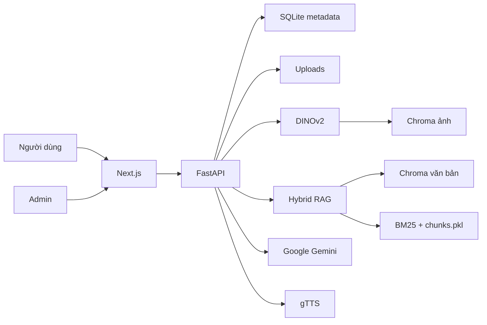

# Kiến Trúc Và Công Nghệ

## Tổng Quan



## Frontend

- Next.js 14 App Router.
- TypeScript và Tailwind CSS.
- Camera qua MediaDevices API.
- Giao tiếp REST tập trung tại `frontend/lib/api.ts`.
- `/api/*` và `/uploads/*` có thể đi qua Next.js rewrite.

## Backend

FastAPI chia module theo nghiệp vụ:

```text
app/
  core/       cấu hình, database, storage
  models/     SQLAlchemy models
  schemas/    Pydantic request/response
  modules/
    auth/     Basic Auth tùy chọn cho admin mutation
    objects/  group, item và ảnh
    vision/   DINOv2 và Chroma ảnh
    rag/      Chroma văn bản, BM25, repair index
    llm/      story, chat, TTS và Gemini client
```

Story, chat và TTS có router riêng nhưng giữ URL cũ:

- `POST /api/generate`
- `POST /api/chat`
- `POST /api/tts`

## Dữ Liệu

### SQLite

Là nguồn metadata chính cho group và item.

### Uploads

Ảnh lưu theo cấu trúc:

```text
uploads/{item_id}/front.jpg
uploads/{item_id}/side.jpg
uploads/{item_id}/back.jpg
```

### Chroma Ảnh

- Collection: `object_search_collection`.
- Vector DINOv2 384 chiều.
- Metadata: `item_id`, `angle`.
- Hỗ trợ vector ảnh gốc và augmentation.

### Hybrid RAG

- Dense retrieval: Chroma + Vietnamese bi-encoder.
- Sparse retrieval: BM25.
- Tài liệu gốc: `chunks.pkl`.
- Item do admin tạo dùng ID ổn định `item-{id}`.
- Update item thay thế document cũ.
- Delete item dọn document tương ứng khi retriever khả dụng.

`Item.description` luôn được đưa vào context trước. Nếu retriever hết RAM, thiếu file hoặc model lỗi lúc chạy, story/chat vẫn dùng description.

## Vòng Đời Item

Đăng ký item:

1. Validate input.
2. `flush()` SQLite để lấy ID nhưng chưa commit.
3. Tạo embedding trước khi thay ảnh/index hiện có.
4. Lưu ảnh và Chroma ảnh.
5. Commit SQLite.
6. Đồng bộ RAG theo best-effort.

Nếu bước ảnh lỗi, backend rollback SQLite và dọn uploads/embedding đã tạo.

## Bảo Mật Admin

Khi `ADMIN_AUTH_ENABLED=true`, các mutation sau yêu cầu HTTP Basic Auth:

- Tạo group.
- Đăng ký item.
- Sửa/xóa item.
- Sửa/xóa ảnh item.

Nếu bật auth nhưng không cấu hình username/password, backend trả 503 thay vì cho phép truy cập.

## Test

- Unit test: Gemini response, fallback RAG, index repair, vòng đời item.
- API contract test: groups, objects, search, story, chat, TTS và admin auth.
- Integration test: Gemini/RAG thật, chỉ chạy khi bật environment flag.
- Test offline dùng SQLite in-memory và mock model/provider.

## Runtime Data

Các thư mục sau là dữ liệu runtime và được Git ignore:

```text
backend/data/
backend/uploads/
```

Khi dùng Docker, `backend_data` và `backend_uploads` là persistent volumes.
