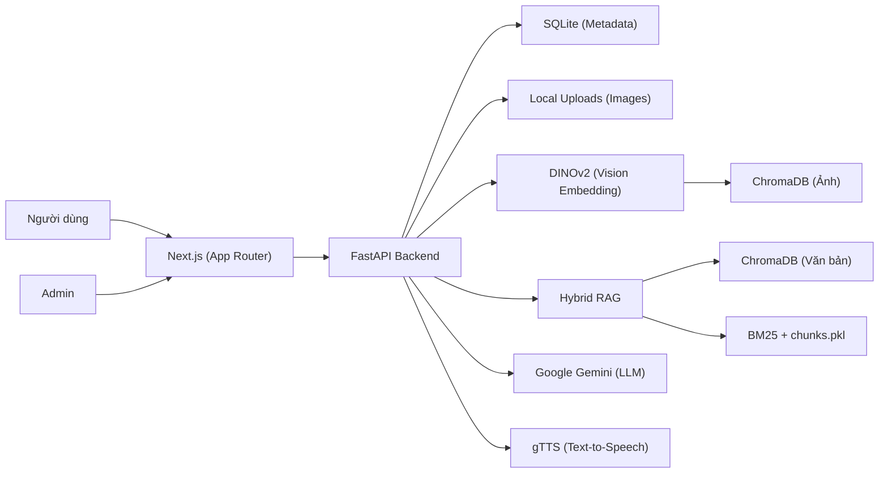

# Kiến Trúc Và Công Nghệ v2

## Tổng Quan

Dựa trên thực tế triển khai, hệ thống được cấu trúc dựa trên Next.js cho Frontend và FastAPI cho Backend, tích hợp chặt chẽ với cơ sở dữ liệu Vector (Chroma) và Mô hình DINOv2 để xử lý nhận diện hình ảnh offline/local, đồng thời tận dụng Google Gemini cho các tác vụ LLM.



## Frontend

- Framework: Next.js 14 App Router.
- Ngôn ngữ & Styling: TypeScript và Tailwind CSS.
- Tương tác phần cứng: Quản lý Camera qua MediaDevices API phục vụ việc chụp ảnh nhận diện.
- Giao tiếp API: REST tập trung tại `frontend/lib/api.ts`. Các endpoints `/api/*` và `/uploads/*` được cấu hình proxy (rewrite) qua Next.js config để xử lý CORS một cách liền mạch.

## Backend

FastAPI chia module theo nghiệp vụ, tổ chức theo cấu trúc monolithic linh hoạt:

```text
app/
  core/       cấu hình, kết nối database, config storage
  models/     SQLAlchemy models
  schemas/    Pydantic request/response schemas
  modules/
    auth/     Basic Auth tùy chọn cho các route admin
    objects/  Xử lý CRUD cho group, item và quản lý upload ảnh vật lý
    vision/   Trích xuất vector DINOv2, augmentation và query Chroma ảnh
    rag/      Chroma văn bản, BM25, đồng bộ và repair index cho LLM
    llm/      sinh câu chuyện (story), chat (Gemini API), TTS (gTTS)
```

Các API route chính yếu cho End User:
- `POST /api/search`: Tìm kiếm nhận diện hình ảnh.
- `POST /api/generate`: Sinh câu chuyện (Storytelling) cá nhân hóa.
- `POST /api/chat`: Hỏi đáp tương tác (Chatbot).
- `POST /api/tts`: Đọc văn bản (Text-To-Speech).

## Quản Lý Dữ Liệu

### SQLite
Là nguồn metadata chính (Single Source of Truth) lưu thông tin về các groups và items (Tên, mô tả, đường dẫn ảnh, ngày tạo). Đảm bảo tính nhất quán dữ liệu ở cấp độ quan hệ.

### Local Uploads
Ảnh được lưu vật lý trong thư mục nội bộ `uploads/` theo cấu trúc chặt chẽ (giảm phụ thuộc vào Cloud Storage bên ngoài):
```text
uploads/{item_id}/front.jpg
uploads/{item_id}/side.jpg
uploads/{item_id}/back.jpg
```

### Chroma Ảnh (Vision Vector DB)
- Collection: `object_search_collection`.
- Model: Vector DINOv2 384 chiều (`facebook/dinov2-small`).
- Metadata: `item_id`, `angle`.
- Đặc tả: Hỗ trợ sinh vector từ ảnh gốc cộng thêm augmentation (lật ngang, crop giữa) nhằm tối ưu khả năng nhận diện dưới các góc chụp sai lệch khác nhau của người dùng.

### Hybrid RAG (Text Vector DB)
- Dense retrieval: Sử dụng Chroma kết hợp Vietnamese bi-encoder cho khả năng tìm kiếm ngữ nghĩa tiếng Việt.
- Sparse retrieval: Sử dụng BM25 để tìm kiếm chính xác từ khóa.
- Dữ liệu thô: `chunks.pkl`.
- Đồng bộ: Khi Admin tạo/sửa một item, trường `Item.description` sẽ được tự động đồng bộ thành document cho hệ thống RAG, phục vụ làm context (bối cảnh) cho Gemini khi sinh câu chuyện và trò chuyện.

## Vòng Đời Đăng Ký Vật Thể (Admin Flow)

1. Validate thông tin nhập liệu từ API (`name`, `description`, ảnh front/side/back).
2. Tạo bản ghi tạm thời (`flush()`) trong SQLite để sinh `item_id` (chưa commit).
3. Lưu ảnh vật lý vào thư mục `uploads/` theo cấu trúc ID.
4. Trích xuất embedding (vector) bằng mô hình DINOv2 cho các ảnh (kể cả ảnh augmentation).
5. Lưu các vector vào Chroma Ảnh.
6. Hoàn tất Commit SQLite.
7. Đồng bộ text vào hệ thống Hybrid RAG (best-effort).
> **Xử lý ngoại lệ:** Nếu quá trình xử lý ảnh hoặc embedding sinh lỗi, backend sẽ thực hiện rollback bản ghi SQLite và dọn dẹp các tệp upload / vector lỗi để tránh tạo ra dữ liệu rác.

## Bảo Mật Admin

Chế độ `ADMIN_AUTH_ENABLED=true` bảo vệ các mutation endpoints khỏi truy cập trái phép. Yêu cầu HTTP Basic Auth. 
Các tính năng được bảo vệ:
- Tạo/Sửa/Xóa group và item.
- Quản lý ảnh của từng item (Thêm, sửa, xóa góc ảnh cụ thể).

## Thuật Toán Nhận Diện (Vision Search Flow)
1. Ảnh đầu vào từ user (query image) được áp dụng augment (ảnh gốc, lật ngang, crop giữa) tạo thành nhiều vectors truy vấn.
2. Query Chroma để lấy ra Top-K (`SEARCH_TOP_K=20`) vectors gần nhất dựa trên Cosine similarity.
3. Gộp nhóm kết quả theo `item_id` (vật thể nào có vector tiệm cận nhất sẽ lấy điểm đó làm đại diện).
4. Sắp xếp và trả về Top N (`SEARCH_TOP_N=3`) vật thể có khả năng cao nhất để hiển thị trực quan cho người dùng lựa chọn (hoặc hệ thống tự focus vào Top 1).
