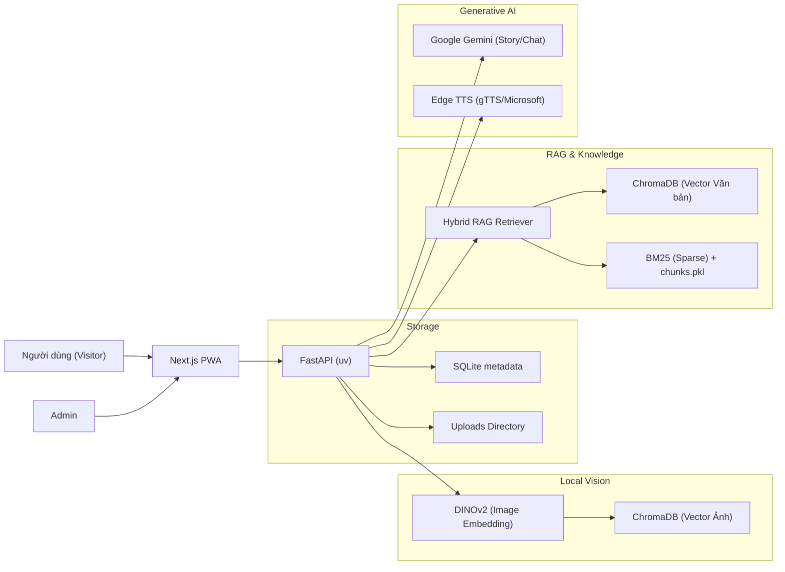

# Kiến Trúc Và Công Nghệ V2 (Cập nhật)

## Tổng Quan

Ở phiên bản V2, hệ thống đã được nâng cấp mạnh mẽ từ mô hình Serverless (Supabase) sang kiến trúc tự chủ hoàn toàn (Self-hosted) với sự kết hợp của FastAPI (Backend) và Next.js (Frontend), sử dụng AI cục bộ (Local AI) cho tác vụ nhận diện hình ảnh và Hybrid RAG cho truy xuất thông tin, nhằm tối ưu chi phí, thời gian phản hồi và khả năng mở rộng đa địa điểm.



## Frontend (Next.js 14)

- Next.js 14 App Router (SSG + SSR + Client Components).
- TypeScript và Tailwind CSS.
- Camera qua MediaDevices API (hỗ trợ luồng nén ảnh trước khi gửi để giảm tải mạng).
- Giao tiếp REST tập trung thông qua `frontend/lib/api.ts` (và các module nhỏ như `search.ts`).
- Rewrite API: Frontend tự động proxy các đường dẫn `/api/*` và `/uploads/*` tới backend FastAPI thông qua `next.config.mjs`, giải quyết bài toán CORS.
- Quản lý State: Custom hooks (ví dụ: `useObjectSearch.ts`) để xử lý logic RAG, Camera, âm thanh.

## Backend (FastAPI với `uv`)

Backend hiện được module hóa theo miền nghiệp vụ (Domain-Driven), quản lý môi trường bằng `uv` thay vì `pip/poetry`:

```text
backend/app/
  core/       # Cấu hình biến môi trường, kết nối DB (SQLite), Storage paths.
  models/     # SQLAlchemy ORM models (Group, Item, v.v.).
  schemas/    # Pydantic models cho validate Request/Response.
  modules/
    auth/     # HTTP Basic Auth bảo vệ các API thay đổi dữ liệu của Admin.
    objects/  # Quản lý vòng đời (CRUD) của Group, Item và ảnh tải lên.
    vision/   # Load model DINOv2, trích xuất embedding và tìm kiếm trên Chroma Ảnh.
    rag/      # Load/cập nhật Chroma Văn bản, BM25, parser tài liệu thành chunk.
    content/  # Sinh câu chuyện (Story), sinh Audio TTS.
    chat/     # Chatbot theo ngữ cảnh bằng Gemini.
```

## Lưu Trữ Dữ Liệu (Local Storage)

- **SQLite (`app.db`)**: Lưu siêu dữ liệu (metadata) của Groups, Items, cài đặt cấu hình, thay vì dùng PostgreSQL để dễ dàng triển khai local/Docker.
- **Uploads (`backend/uploads/`)**: Lưu ảnh gốc do Admin tải lên. Ví dụ: `uploads/items/{item_id}/front.jpg`. Các thư mục này nằm ngoài tracking của Git.

## Khối Xử Lý Trí Tuệ Nhân Tạo (AI Modules)

### 1. Nhận diện hình ảnh (Vision)
- Thay vì gửi ảnh thô cho Gemini Vision API (như V1), V2 sử dụng mô hình mã nguồn mở **DINOv2** chạy cục bộ để mã hóa hình ảnh (Image Embedding 384 chiều).
- **ChromaDB Ảnh (`object_search_collection`)**: Vector hóa các góc chụp được lưu vào CSDL vector. Khi User quét camera, ảnh được nén -> tạo vector -> đối chiếu cosine similarity. Tăng tốc độ nhận dạng và không tốn phí API.

### 2. Truy xuất thông tin (Hybrid RAG)
- Không còn dùng file JSON tĩnh cứng nhắc. Admin có thể tải lên tài liệu tham khảo cho từng Group/Item.
- **Dense Retrieval**: Sử dụng mô hình tiếng Việt (Vietnamese bi-encoder) để mã hóa ngữ nghĩa văn bản vào ChromaDB.
- **Sparse Retrieval**: Sử dụng thuật toán BM25 lưu cấu trúc trong `chunks.pkl` để tra cứu theo từ khóa chính xác.
- **Fallback**: Nếu RAG hỏng hoặc hết RAM, hệ thống dùng `Item.description` từ SQLite làm context dự phòng.

### 3. Sinh ngôn ngữ tự nhiên (Gemini) & Text-to-Speech
- **Google Gemini API**: Chỉ được gọi ở bước sinh câu chuyện (Storytelling) và trả lời Chatbot sau khi RAG đã cung cấp đủ bối cảnh (Context Grounding). Điều này loại bỏ Hallucination (ảo giác).
- **TTS (Text-to-Speech)**: Edge TTS được sử dụng để tạo giọng đọc tự nhiên đa ngôn ngữ. Hỗ trợ Audio Streaming.

## Vòng Đời Của Một Vật Thể (Item Lifecycle)

1. **Đăng ký (Admin)**: Nhập tên, mô tả cơ bản. Cấp phát `item_id` qua SQLite.
2. **Hình ảnh**: Tải lên nhiều góc ảnh. Hệ thống trích xuất vector DINOv2 và thêm vào Chroma Ảnh.
3. **Tri thức (RAG)**: Admin nhập tài liệu chuyên sâu. Hệ thống tự động chia cắt (chunking) và cập nhật vào Chroma Văn bản & BM25.
4. **Khách tham quan (Visitor)**: Quét ảnh -> DINOv2 nhận diện -> Truy xuất RAG -> Gemini sinh nội dung -> TTS đọc nội dung.

## Bảo Mật & Quản Trị (Admin Auth)

Hỗ trợ quản trị viên quản lý nhiều triển lãm (Groups). Các API cập nhật dữ liệu (`POST`, `PUT`, `DELETE` trong module objects/rag) được bảo vệ bằng **HTTP Basic Auth** (`ADMIN_AUTH_ENABLED=true`). Nếu không có xác thực, API trả về 401/403.

## Triển Khai (Deployment)

Hỗ trợ Docker và Docker Compose. Dữ liệu trạng thái (Runtime data) được lưu trữ tại các volumes:
- `backend/data/`: Chứa `app.db` và các CSDL Vector (Chroma).
- `backend/uploads/`: Chứa hình ảnh người dùng tải lên.
Đảm bảo Persistent Data giữa các lần khởi động lại container.
