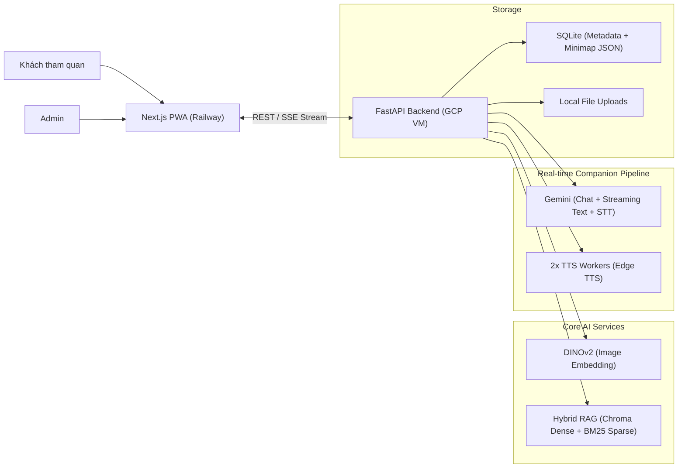

# Kiến Trúc Và Công Nghệ V3

## Tổng Quan

Ở phiên bản V3, hệ thống đã hoàn thiện bước chuyển mình thành một nền tảng chuyên nghiệp với mô hình triển khai tách rời (Frontend trên Serverless/Edge, Backend trên Cloud VM). Điểm nhấn kiến trúc là **Luồng dữ liệu thời gian thực (Streaming Pipeline)** phục vụ AI Companion và **Hệ thống tự động hóa CI/CD**.

## 1. Frontend (Next.js 14 - Railway)

Khối Frontend được tách hoàn toàn khỏi Backend VM để chạy trên hạ tầng toàn cầu (Railway), mang lại tốc độ phản hồi tĩnh tốt nhất.
- **Backend-Driven UI:** Các gợi ý câu hỏi (`||Q:...||`) hoặc điểm đến tiếp theo (`next_item_name`) được Backend chèn vào luồng Server-Sent Events (SSE). Frontend dùng Regex để parse và render linh động thành các "Action Buttons" (Nút bấm tương tác).
- **Trạng thái Minimap Động:** Cấu hình Minimap (JSON) được load từ API, kết hợp với state `visited_items` trong `localStorage` để render SVG Minimap động, highlight điểm đến tiếp theo.
- **WebRTC & Browser Speech:** Sử dụng MediaRecorder để bắt âm thanh trực tiếp từ trình duyệt gửi làm STT; xử lý Audio Autoplay Policy khéo léo để phát audio mượt mà.
- **Glassmorphism UI:** Các UI/UX được tối ưu với backdrop-blur, custom CSS dropdowns cho bộ chọn đa ngôn ngữ (i18n).

## 2. Backend (FastAPI - GCP VM)

Backend tối ưu cực sâu cho luồng hội thoại thời gian thực, quản lý bằng `uv`:
- **Real-time Streaming Pipeline:** API `/api/companion/chat/stream` trả về dữ liệu qua SSE.
- **Early Phrase Chunking & Concurrent TTS:** Khi Gemini đang stream text về, Backend chặn lại, sử dụng bộ tách câu (Regex) để cắt thành các cụm từ (phrase) vừa đủ ý. Các cụm từ này được tống ngay vào 2 TTS Workers chạy song song. Nhờ vậy, ngay khi Frontend nhận chữ đầu tiên, audio của câu đó cũng đã sẵn sàng để phát, giảm triệt để khoảng lặng.
- **Speech-to-Text (STT):** Tích hợp Gemini 1.5 Flash cho STT để chuyển đổi file âm thanh (WebM) thành tiếng Việt/Anh chuẩn xác với độ trễ thấp.
- **Prompt Shield & Injection Prevention:** Lớp khiên bảo vệ LLM trước các prompt bẩn, ép buộc AI luôn theo đúng Persona (ví dụ: Lê Quý Đôn 18 tuổi, xưng "Ta", "Bạn").

## 3. Hệ thống Gợi ý & Quest (MVP)

- CSDL SQLite lưu lại tiến trình đã quét (`visited_item_ids`).
- Backend query loại trừ các điểm đã quét để tìm điểm kế tiếp (`next_item`).
- Hệ thống tiêm ngữ cảnh ngầm vào Prompt (Ví dụ: "Hãy chèn thêm gợi ý đến Đại Trung Môn").
- Trạng thái Quest được quản lý kết hợp giữa DB (Item match) và Frontend UI (Quest HUD, smart idle timer).

## 4. Bảo Mật & CI/CD Pipeline

Toàn bộ quá trình phát triển được kiểm soát bởi GitHub Actions:
- **Frontend CI/CD:** Tự động Lint & Build test. Deploy tự động lên Railway khi có push vào nhánh `main`.
- **Backend CI/CD:** Chạy Pytest siêu tốc bằng `uv run pytest` trên GitHub-hosted runners.
- **CD to GCP VM:** Khi Pass CI, GitHub Actions gọi webhook hoặc SSH thẳng vào GCP VM để kéo code (`git pull`) và restart các container (FastAPI, Caddy) mà không gây sập hệ thống (Zero-downtime deploy).
- Caddy Server tự động cấp phát chứng chỉ SSL/TLS cho backend, sẵn sàng phục vụ HTTPS cho PWA.
