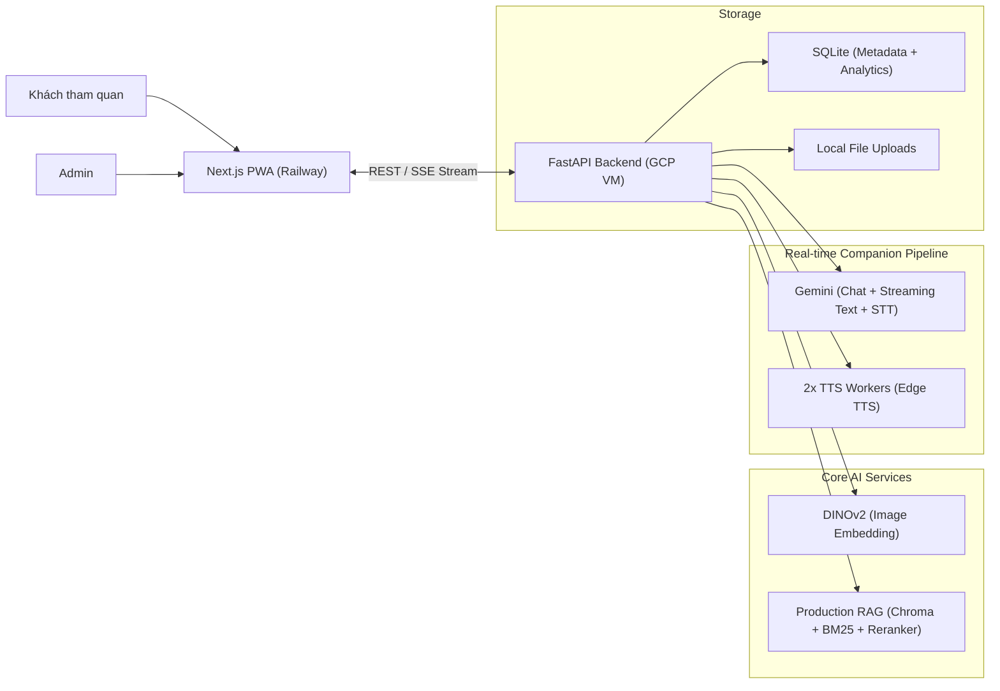

# Kiến Trúc Và Công Nghệ V4

## Tổng Quan

Ở phiên bản V4, hệ thống kiến trúc được củng cố theo định hướng **Production-Ready**, tập trung vào nâng cao độ tin cậy của AI (RAG Accuracy) và cung cấp bộ công cụ đo lường chất lượng sản phẩm (Product Analytics). Mô hình triển khai vẫn duy trì sự linh hoạt: Frontend trên Railway và Backend trên GCP VM.

## 1. Frontend (Next.js 14 - Railway)

Khối Frontend được nâng cấp để hỗ trợ đa ngôn ngữ toàn diện và tối ưu trải nghiệm Mobile:
- **Đa ngôn ngữ toàn diện (i18n):** Hệ thống được mở rộng hỗ trợ 6 ngôn ngữ (vi, en, ko, ja, zh, fr) trên mọi UI/UX (Menu, Popup, Hướng dẫn, Đánh giá sao).
- **Tối ưu Mobile UX:** Giải quyết triệt để lỗi layout shift trên Safari/Chrome Mobile bằng Wrapper `100dvh` toàn cục và fixed overlay. Gom luồng tải ảnh/chụp ảnh vào chung giao diện Scan.
- **MediaRecorder STT:** Thay thế Web Speech API bằng `MediaRecorder` bắt âm thanh trực tiếp và gửi khối audio (WebM) qua mạng, khắc phục lỗi Abort trên iOS.

## 2. Backend (FastAPI - GCP VM)

Backend tối ưu cực sâu cho luồng RAG và thu thập Analytics:
- **Production RAG Pipeline:** 
  - Thêm mô-đun chuẩn hoá (Normalization) để đồng nhất định dạng văn bản, giảm nhiễu trước khi vector hóa.
  - Tích hợp `Heuristic Reranker`: Sau bước truy xuất (Retriever) mở rộng (`search_K`), các chunks được xếp hạng lại (Reranking) dựa trên từ khoá hiện vật, bối cảnh nhóm tài liệu, giúp cải thiện độ chính xác câu trả lời đáng kể.
  - Ghi nhận `Confidence Score` để cảnh báo nếu ngữ cảnh trả về có độ tin cậy thấp.
- **Product Eval & Analytics:** 
  - Khai báo các mô-đun Analytics để lưu vết mọi hoạt động (RAG Traces, Chat Logs, STT Cost).
  - Tích hợp bộ RAGAS Evaluation nội bộ (Faithfulness & Answer Relevancy) qua file `ragas_eval.py` để test nhanh độ chính xác của các câu lệnh Prompt và Dataset.
- **Speech-to-Text (STT) ổn định:** Gọi trực tiếp API LLM (Gemini) để transcribe audio với tốc độ cao.

## 3. Quản lý trạng thái và Bảo mật

- **RAG Security & Governance:** 
  - Đánh dấu tài liệu nháp (`visibility=draft`). Backend RAG sẽ tự động bỏ qua các tài liệu nháp khi truy xuất câu trả lời cho Khách tham quan.
  - Giới hạn lịch sử truyền tải lên LLM tối đa 10 tin nhắn nhằm ngăn tràn Token và chống chèn Prompt lặp.
- **Shield Clause:** Tiếp tục gia cố hệ thống bảo mật Prompt, ngăn chặn triệt để Prompt Injection.

## 4. Bảo Mật & CI/CD Pipeline

Toàn bộ quá trình phát triển được kiểm soát bởi GitHub Actions:
- **Frontend CI/CD:** Tự động Lint & Build test. Deploy tự động lên Railway khi có push vào nhánh `main`.
- **Backend CI/CD:** Chạy Pytest siêu tốc bằng `uv run pytest` với custom `--basetemp` để vượt qua các lỗi phân quyền trên CI Windows/Linux.
- **Zero-downtime Deploy:** CI/CD tự động SSH vào GCP VM, chạy bash script và Restart Container không gián đoạn dịch vụ.
