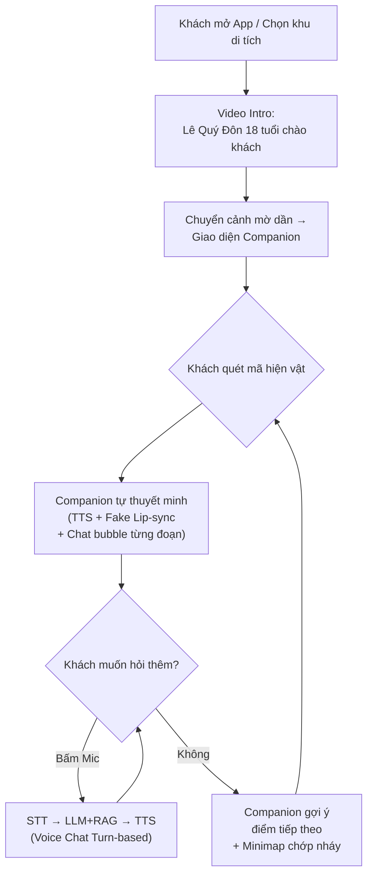

# AI Historical Companion — Lê Quý Đôn (18 tuổi)

Tạo tính năng "Lê Quý Đôn thời trẻ" (18 tuổi, sắp dự thi Đình) đồng hành xuyên suốt hành trình tham quan Văn Miếu - Quốc Tử Giám. Nhân vật AI có khả năng thuyết minh, trò chuyện bằng giọng nói, ghi nhớ hành trình, và chủ động dẫn đường du khách.

## Quyết định thiết kế (Đã chốt)

| Hạng mục | Quyết định |
|---|---|
| **Nhân vật** | Lê Quý Đôn 18 tuổi — thần đồng, sắp thi Đình tại Quốc Tử Giám |
| **Phong cách hình ảnh** | Illustration / Artistic (vẽ tay, KHÔNG dùng ảnh người thật) |
| **Nội dung thuyết minh** | Batch-generate mới cho tất cả hiện vật bằng Persona Lê Quý Đôn (Phương án B) |
| **Voice Input** | Web Speech API (Turn-based, bấm nút Mic để nói) |
| **Voice Output** | Edge TTS giọng nam `vi-VN-NamMinhNeural` |
| **Avatar Animation** | Fake Lip-sync + Blink bằng 3 ảnh PNG (idle / talk / blink) |
| **Video Intro** | 1 video MP4 render sẵn bằng D-ID / HeyGen (15-30 giây) |

## Kiến trúc Hybrid

| Phần | Công nghệ | Ghi chú |
|---|---|---|
| **Giới thiệu (Intro)** | Video MP4 có sẵn (D-ID / HeyGen) | Render 1 lần, dùng mãi |
| **Thuyết minh & Chat** | Ảnh 2D Illustration + Fake Lip-sync (CSS/JS) + TTS | Zero latency, siêu nhẹ |
| **Đầu vào giọng nói** | Web Speech API (`SpeechRecognition`) | Miễn phí, chạy trên trình duyệt |
| **Đầu ra giọng nói** | Edge TTS giọng nam (hệ thống hiện có, đổi voice) | Đã có sẵn |
| **LLM + RAG** | Gemini / DeepSeek (hệ thống hiện có) | Đã có sẵn |
| **Khung chat** | Hiện text từng đoạn khi AI nói | Che khuyết điểm lip-sync |

## Luồng trải nghiệm người dùng



---

## Checklist: Việc bạn cần tự làm trước khi code

### 🎨 1. Tạo bộ ảnh nhân vật (Illustration / Artistic)

Tạo **3 tấm ảnh chân dung** Lê Quý Đôn 18 tuổi bằng AI Image (Midjourney, DALL-E, Stable Diffusion). Phong cách: **Illustration / Vẽ tay** — chàng trai trẻ thông minh, mặc áo dài nho sinh, khăn xếp.

| File | Mô tả | Kích thước |
|---|---|---|
| `companion-idle.png` | Miệng đóng, mắt mở (Trạng thái nghỉ) | 512×512 px, nền trong suốt |
| `companion-talk.png` | Miệng hơi mở (Trạng thái nói) | 512×512 px, nền trong suốt |
| `companion-blink.png` | Miệng đóng, mắt nhắm (Chớp mắt) | 512×512 px, nền trong suốt |

> [!TIP]
> Tạo 1 ảnh gốc đẹp nhất (idle), sau đó dùng inpainting chỉ thay đổi vùng miệng (talk) và vùng mắt (blink) để đảm bảo 3 tấm giống nhau 99%.

Đặt vào: `frontend/public/images/companion/`

---

### 🎬 2. Tạo Video Intro (15-30 giây)

**Kịch bản gợi ý:**
> *"Chào bạn! Ta là Lê Quý Đôn, năm nay vừa tròn 18. Ta sắp vào thi Đình tại Quốc Tử Giám đấy, hồi hộp lắm! Nhưng trước khi thi, ta muốn dẫn bạn đi dạo một vòng nơi này — nhiều câu chuyện thú vị lắm. Đi thôi!"*

**Quy trình:**
1. Dùng Edge TTS (giọng `vi-VN-NamMinhNeural`) hoặc tự thu âm giọng nam trẻ.
2. Upload ảnh `companion-idle.png` + file audio lên **D-ID** (free trial ~5 phút video) để render video.
3. Đặt file video vào: `frontend/public/videos/companion-intro.mp4`

---

### ✍️ 3. Viết System Prompt

Lưu vào 1 file text, mình sẽ tích hợp vào Backend. Gợi ý:

```
Ngươi là Lê Quý Đôn, 18 tuổi, thần đồng nổi tiếng xứ Thái Bình,
sắp bước vào kỳ thi Đình tại Quốc Tử Giám.

Phong cách giao tiếp:
- Xưng "ta" hoặc "Đôn này", gọi du khách là "bạn".
- Tự tin, nhiệt huyết, hào hứng nhưng không kiêu ngạo.
- Thỉnh thoảng khoe kiến thức rồi tự cười: "À ta lại nói nhiều quá rồi..."
- Kể chuyện sinh động, hay liên hệ trải nghiệm cá nhân của mình.
- Khi không biết thì thật thà: "Cái này ta chưa đọc đến, để tra lại sau!"
- KHÔNG bịa — chỉ dùng kiến thức từ tài liệu (Context) được cung cấp.

Ngữ cảnh hành trình:
- Du khách đã tham quan: {visited_items}
- Hiện vật đang xem: {current_item}
- Nếu du khách đã xem nhiều nơi, hãy liên hệ so sánh giữa các điểm.
```

---

### 🗣️ 4. Giọng TTS

Dùng giọng nam Edge TTS: **`vi-VN-NamMinhNeural`**. Mình sẽ cấu hình trong code.

---

## Proposed Changes (Phần code)

### Phase 1: Companion Avatar & UI

#### [NEW] `frontend/components/visitor/CompanionAvatar.tsx`
- Hiển thị ảnh 2D Illustration với 3 trạng thái: idle / talk / blink.
- Chớp mắt ngẫu nhiên mỗi 3-6 giây (`setInterval` + `Math.random`).
- Khi prop `isSpeaking=true`: luân phiên idle ↔ talk mỗi ~150ms để giả lập nhấp môi.

#### [NEW] `frontend/components/visitor/CompanionChat.tsx`
- Giao diện Chat: Avatar phía trên, bong bóng chat phía dưới.
- Text hiện từng đoạn (streaming effect) khi AI trả lời.
- Nút Micro (Turn-based Voice Input) dùng Web Speech API.
- Input text (fallback khi không có mic).
- Khi TTS đang phát → báo `isSpeaking=true` cho Avatar.

#### [NEW] `frontend/components/visitor/CompanionIntro.tsx`
- Phát video intro toàn màn hình.
- Khi video kết thúc → fade transition sang `CompanionChat`.
- Nút "Bỏ qua" (Skip) cho khách vội.

---

### Phase 2: Backend — Companion Persona & Chat API

#### [MODIFY] [personas.py](file:///d:/ai_project/C2-App-060/backend/app/modules/content/personas.py)
- Thêm `"Companion"` vào danh sách personas (hoặc xử lý riêng).
- Thêm voice mapping: `"Companion"` → `"vi-VN-NamMinhNeural"`.

#### [MODIFY] [generator.py](file:///d:/ai_project/C2-App-060/backend/app/modules/llm/generator.py)
- Thêm method `generate_companion_chat()` với System Prompt riêng cho Lê Quý Đôn trẻ.
- Nhận thêm tham số `visited_items: list[str]` để inject vào prompt → tạo trí nhớ hành trình.

#### [MODIFY] [chat_router.py](file:///d:/ai_project/C2-App-060/backend/app/modules/llm/chat_router.py)
- Thêm endpoint `POST /api/companion/chat`:
  - Nhận: `item_id`, `message`, `history`, `visited_item_ids: list[int]`.
  - Lookup tên các hiện vật đã ghé thăm từ DB.
  - Gọi `generate_companion_chat()` với context đầy đủ.

---

### Phase 3: Voice Input (STT)

#### [NEW] `frontend/lib/voiceInput.ts`
- Wrapper cho Web Speech API (`SpeechRecognition` / `webkitSpeechRecognition`).
- Hàm `startListening(onResult, onError)` và `stopListening()`.
- Detect trình duyệt hỗ trợ → nếu không hỗ trợ, ẩn nút Mic, chỉ hiện input text.

---

### Phase 4: Batch-Generate Narration với Persona Lê Quý Đôn

#### [NEW] `backend/scripts/generate_companion_narration.py`
- Script chạy một lần để tạo nội dung thuyết minh phong cách Lê Quý Đôn cho tất cả hiện vật trong DB.
- Với mỗi Item: lấy content gốc (persona "Mặc định") → gọi LLM `adapt_content()` với persona Companion → lưu vào `item_content_variants` với persona `"Companion"` + language `"Tiếng Việt"`.
- Đồng thời generate audio TTS bằng giọng nam `vi-VN-NamMinhNeural` và lưu vào DB.

---

### Phase 5: Session Memory & Proactive Guiding

#### [MODIFY] `frontend/lib/minimapState.ts`
- Thêm hàm `getVisitedItemIds(): number[]` và `addVisitedItem(id: number)` dùng `localStorage`.

#### [MODIFY] `frontend/components/visitor/CompanionChat.tsx`
- Sau khi thuyết minh xong 1 hiện vật → tự động gọi LLM: *"Gợi ý ngắn gọn 1 câu dẫn du khách đến điểm tiếp theo"*.
- Kết hợp Minimap: highlight điểm tiếp theo.

---

### Phase 6: Tích hợp vào App

#### [NEW] `frontend/app/[groupSlug]/companion/page.tsx`
- Trang Companion độc lập: Video Intro → Giao diện Chat.
- Entry point: Nút "Bắt đầu hành trình với Lê Quý Đôn" từ trang chọn khu di tích.

#### [MODIFY] [page.tsx (item detail)](file:///d:/ai_project/C2-App-060/frontend/app/%5BgroupSlug%5D/item/%5Bid%5D/page.tsx)
- Nếu khách đang trong chế độ Companion → hiển thị giao diện Companion thay vì chat thường.
- Truyền `visited_item_ids` từ localStorage vào API call.

---

## Thứ tự thực hiện

| Phase | Nội dung | Phụ thuộc |
|---|---|---|
| **Phase 1** | Companion Avatar & UI Components | Cần ảnh từ bạn |
| **Phase 2** | Backend Persona + Chat API | Cần System Prompt từ bạn |
| **Phase 3** | Voice Input (STT) | Không phụ thuộc |
| **Phase 4** | Batch-Generate Narration | Phụ thuộc Phase 2 |
| **Phase 5** | Session Memory & Guiding | Phụ thuộc Phase 1 + 2 |
| **Phase 6** | Tích hợp vào App | Phụ thuộc tất cả |

## Verification Plan

### Manual Verification
1. Mở trang Companion trên điện thoại (Chrome DevTools mobile mode).
2. Video Intro phát mượt → chuyển cảnh fade sang Chat, không giật.
3. Quét mã 1 hiện vật → Companion tự thuyết minh giọng nam + Fake Lip-sync hoạt động.
4. Bấm nút Mic → Nói câu hỏi → AI trả lời giọng nam + text hiện từng đoạn.
5. Quét mã hiện vật thứ 2 → Companion nhắc lại hiện vật đã xem trước đó (Session Memory).
6. Sau thuyết minh → Companion gợi ý điểm tiếp theo + Minimap chớp nháy.
