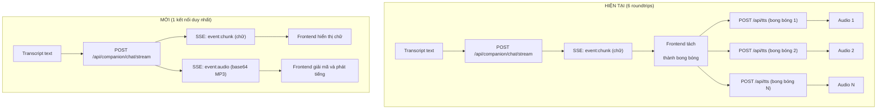

# Backend-Driven Pipeline Streaming

**Phạm vi thay đổi:** Chỉ thay đổi luồng **sau khi STT trả về transcript text**. Luồng ghi âm, phát hiện im lặng, và Gemini STT giữ nguyên 100%.

## Luồng hiện tại (sau STT) vs Luồng mới



---

## Phần 1: BACKEND (FastAPI)

> [!IMPORTANT]
> Chỉ sửa 1 file duy nhất: `chat_router.py`. File `generator.py` và `tts.py` giữ nguyên.

#### [MODIFY] [chat_router.py](file:///d:/ai_project/C2-App-060/backend/app/modules/llm/chat_router.py)

Sửa hàm `event_generator()` bên trong endpoint `POST /api/companion/chat/stream` (dòng 306-326).

**Kiến trúc mới:** 3 coroutine chạy song song bằng `asyncio`:

```
┌─────────────────┐     tts_queue      ┌──────────────┐
│  llm_producer   │ ──────────────────► │ tts_consumer │
│  (stream LLM)   │                    │ (Edge TTS)   │
└────────┬────────┘                    └──────┬───────┘
         │ event:chunk                        │ event:audio
         ▼                                    ▼
    ┌─────────────────────────────────────────────┐
    │            event_queue (chung)               │
    └──────────────────┬──────────────────────────┘
                       │
                       ▼
              event_generator() yield
              ──► SSE về Frontend
```

**Chi tiết:**

1. **`llm_producer`** (async task):
   - Gọi `generate_companion_chat_stream()` y hệt hiện tại
   - Mỗi token nhận được → `await event_queue.put(event:chunk)`
   - Đồng thời gom token vào buffer `current_sentence`
   - Khi gặp dấu kết thúc câu (regex: `[.?!]` theo sau bởi khoảng trắng, hoặc `\n\n`) → cắt câu hoàn chỉnh → `await tts_queue.put(sentence)`
   - Khi stream LLM kết thúc → đẩy nốt phần text còn sót → `tts_queue.put(None)` (tín hiệu kết thúc)

2. **`tts_consumer`** (async task):
   - Chờ nhận câu từ `tts_queue`
   - Gọi `_synthesize_speech_async(sentence, "Tiếng Việt", "Companion")` (hàm async có sẵn trong `tts.py`)
   - Mã hóa audio bytes → base64 string
   - `await event_queue.put(event:audio)` kèm data `{"audio_base64": "..."}`
   - Khi nhận `None` → `event_queue.put(None)` (tín hiệu kết thúc toàn bộ)

3. **`event_generator`** (async generator, yield SSE):
   - Kick-start 2 task trên bằng `asyncio.create_task()`
   - Vòng lặp `while True`: lấy event từ `event_queue`, yield ra SSE
   - Khi nhận `None` → yield `event: done` → thoát

**Các event SSE sẽ gửi về Frontend:**

| Event | Data | Mô tả |
|-------|------|-------|
| `event: metadata` | `{"next_item_id": ..., "next_item_name": ...}` | Giữ nguyên như cũ |
| `event: chunk` | `{"text": "..."}` | Từng token chữ từ LLM (giữ nguyên) |
| `event: audio` | `{"audio_base64": "..."}` | **MỚI** – file MP3 mã hóa base64 |
| `event: done` | `{}` | Kết thúc stream (giữ nguyên) |
| `event: error` | `{"detail": "..."}` | Lỗi (giữ nguyên) |

---

## Phần 2: FRONTEND (Next.js)

> [!IMPORTANT]
> Sửa 2 file: `api.ts` (nhỏ) và `CompanionChat.tsx` (chính).
> File `chatTts.ts` **giữ nguyên** (vẫn dùng cho các chỗ khác nếu có).

#### [MODIFY] [api.ts](file:///d:/ai_project/C2-App-060/frontend/lib/api.ts)

- Thêm `'audio'` vào union type của `AsyncGenerator` return type (dòng 825):
  ```diff
  -): AsyncGenerator<{ type: 'metadata' | 'chunk' | 'done' | 'error', data: any }, ...>
  +): AsyncGenerator<{ type: 'metadata' | 'chunk' | 'audio' | 'done' | 'error', data: any }, ...>
  ```
- Không cần sửa gì thêm. Hàm parse SSE đã tự động xử lý mọi event type.

#### [MODIFY] [CompanionChat.tsx](file:///d:/ai_project/C2-App-060/frontend/components/visitor/CompanionChat.tsx)

**Thay đổi 1: Thay hệ thống Audio Queue** (dòng 184-213)

- **Xóa:** `processAudioQueue` gọi `playChatTts()` (gọi HTTP fetch TTS)
- **Xóa:** `enqueueAudio(text)` (nhận text → đẩy vào queue)
- **Thêm:** `enqueueAudioBlob(url)` (nhận ObjectURL → đẩy vào queue)
- **Thêm:** `processAudioQueue` mới: tạo `new Audio(url)`, play, chờ `onended`, rồi `revokeObjectURL`
- **Thêm:** `stopAllAudio()` thay thế `stopChatTts()` ở mọi nơi (cleanup effect dòng 180, hàm send dòng 199, toggleMic dòng 429)

**Thay đổi 2: Vòng lặp stream** (dòng 247-276)

- **Xóa:** Logic tách bong bóng bằng `split(/\n\n+/)` + `lastSpokenIndex` + `enqueueAudio`
- **Thêm:** Xử lý `chunk.type === "audio"`:
  ```typescript
  } else if (chunk.type === "audio") {
    // Giải mã base64 → Blob → ObjectURL → đẩy vào queue
    const bytes = Uint8Array.from(atob(chunk.data.audio_base64), c => c.charCodeAt(0));
    const blob = new Blob([bytes], { type: 'audio/mpeg' });
    enqueueAudioBlob(URL.createObjectURL(blob));
  }
  ```

**Thay đổi 3: Import** (dòng 4-5)

- **Giữ:** `import { stopChatTts } from "@/lib/chatTts"` → đổi thành dùng `stopAllAudio` nội bộ
- Hoặc xóa import `playChatTts, stopChatTts` nếu không còn dùng ở đâu khác trong file

---

## Tổng kết thay đổi

| File | Phạm vi sửa | Mô tả |
|------|-------------|-------|
| `backend/.../chat_router.py` | Hàm `event_generator()` (~20 dòng cũ → ~65 dòng mới) | Thêm `asyncio.Queue`, `llm_producer`, `tts_consumer` |
| `frontend/lib/api.ts` | 1 dòng | Thêm `'audio'` vào union type |
| `frontend/.../CompanionChat.tsx` | ~50 dòng | Đổi Audio Queue từ text-based sang blob-based, xử lý `event: audio` |

## Verification Plan

### Manual Verification
1. Gửi tin nhắn text → kiểm tra chữ stream mượt + tiếng phát từng đoạn
2. Bấm mic, nói một câu dài → kiểm tra toàn bộ luồng voice-to-voice
3. Mở DevTools tab Network → **KHÔNG CÒN** các request lẻ tẻ `POST /api/tts` trong lúc stream
4. Chỉ còn duy nhất 1 kết nối `POST /api/companion/chat/stream` (EventStream)
