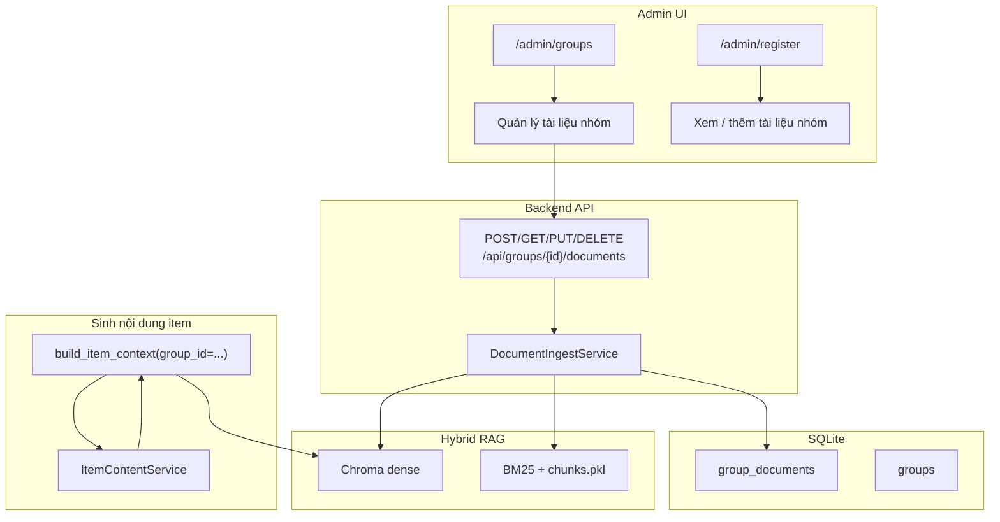
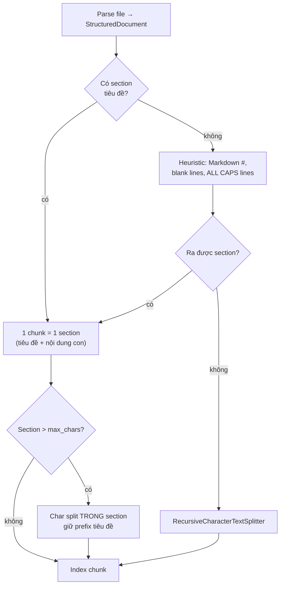

# Group Knowledge Documents — Thiết Kế (Tiếp Nối Item Content + RAG)

## Goal

Admin có thể **gắn tài liệu tri thức theo nhóm** (text, `.txt`, `.docx`, `.pdf`). Hệ thống **trích xuất văn bản → chunk → index vào hybrid RAG** (Chroma dense + BM25). Khi sinh mô tả hiện vật (prewarm / on-demand / chat), retrieval **ưu tiên tài liệu cùng nhóm** với item. **Sửa hoặc xóa tài liệu** phải **đồng bộ xóa/cập nhật vector** tương ứng — không để orphan trong Chroma/BM25.

Tài liệu này **bổ sung** cho [`2026-06-13-item-content-cache-design.md`](2026-06-13-item-content-cache-design.md), không thay thế.

---

## Bối Cảnh Hiện Tại

| Thành phần | Hiện trạng |
|------------|------------|
| Nhóm | SQLite `groups`, item có `group_id` |
| Admin | `/admin/groups` (tạo/chọn nhóm), `/admin/register` (đăng ký vật thể theo nhóm) |
| RAG index | Chroma `rag_chroma/` + `chunks.pkl` + BM25 — **một corpus chung** |
| Item trong RAG | `upsert_item_document(item_id, description)` — ID `item-{id}` |
| Retrieval | `build_item_context` → query global, **chưa lọc theo group** |
| Item content DB | `item_content_variants` — text + audio BLOB, prewarm qua Gemini |

**Thiếu:** metadata tài liệu nhóm trong SQLite, API upload/quản lý, chunk indexing, xóa vector theo document, UI admin, retrieval theo scope nhóm.

---

## Phạm Vi

### In scope

- CRUD tài liệu gắn `group_id` (SQLite metadata + file gốc trên disk).
- Upload: paste text, `.txt`, `.docx`, `.pdf`.
- Parse → **chunk theo tiêu đề/cấu trúc trước**, fallback cắt theo ký tự → upsert Chroma + BM25 với **ID ổn định** theo document/chunk.
- Delete/update document → xóa/rebuild toàn bộ chunk vectors của document đó.
- Xóa nhóm → cascade xóa documents + vectors.
- `build_item_context` nhận `group_id` → retrieval scoped.
- Khi tài liệu nhóm đổi → invalidate `item_content_variants` của mọi item thuộc nhóm (hash mới).
- UI admin: quản lý tài liệu trên trang nhóm (+ link từ đăng ký vật thể).

### Out of scope

- OCR PDF scan ảnh (chỉ text layer PDF).
- Phân quyền theo user (dùng `ADMIN_AUTH_ENABLED` như hiện tại).
- Full-text search UI riêng cho admin.
- Thay embedding model RAG.

---

## Kiến Trúc Tổng Quan



---

## Mô Hình Dữ Liệu

### Bảng `group_documents`

```sql
CREATE TABLE group_documents (
    id                INTEGER PRIMARY KEY AUTOINCREMENT,
    group_id          INTEGER NOT NULL REFERENCES groups(id) ON DELETE CASCADE,
    title             TEXT NOT NULL,
    source_type       TEXT NOT NULL,
    -- 'text' | 'txt' | 'docx' | 'pdf'
    original_filename TEXT,
    storage_path      TEXT,           -- file gốc: data/group_docs/{group_id}/{doc_id}.{ext}
    extracted_text    TEXT NOT NULL,  -- plain text sau parse (để re-chunk không cần parse lại)
    chunk_count       INTEGER NOT NULL DEFAULT 0,
    status            TEXT NOT NULL DEFAULT 'ready',
    -- 'processing' | 'ready' | 'failed'
    error_message     TEXT,
    knowledge_version INTEGER NOT NULL DEFAULT 1,  -- tăng mỗi lần re-index
    created_at        DATETIME NOT NULL DEFAULT CURRENT_TIMESTAMP,
    updated_at        DATETIME NOT NULL DEFAULT CURRENT_TIMESTAMP
);
```

**Không lưu vector trong SQLite** — vector chỉ ở Chroma/BM25 (giống thiết kế RAG hiện tại). SQLite giữ metadata + text gốc để re-index và audit.

### Bảng `groups` — thêm cột (tuỳ chọn)

```sql
ALTER TABLE groups ADD COLUMN knowledge_version INTEGER NOT NULL DEFAULT 1;
```

Tăng `groups.knowledge_version` mỗi khi bất kỳ document nào trong nhóm thay đổi → dùng trong `content_hash` của `item_content_variants`:

```
content_hash = SHA256(item.description + str(group.knowledge_version))
```

→ Item content đã prewarm **tự invalidate** khi tri thức nhóm đổi.

---

## RAG: Chunk ID & Metadata

### ID vector (Chroma)

Mỗi chunk một ID **ổn định, có thể xóa hàng loạt**:

```
group-doc-{document_id}-chunk-{chunk_index}
```

Ví dụ: `group-doc-12-chunk-0`, `group-doc-12-chunk-1`, ...

Item document giữ `item-{item_id}` như hiện tại.

### Metadata chunk

```python
{
    "source": "group_doc",
    "group_id": 3,
    "document_id": 12,
    "document_title": "Lịch sử Văn Miếu",
    "section_title": "Kiến trúc tam quan",
    "heading_level": 2,
    "chunk_index": 0,
    "chunk_strategy": "section",   # "section" | "section_split" | "character"
    "page": "group-doc-12-chunk-0",
}
```

Citation trong Gemini prompt: `[Mục: {section_title}]` hoặc `[Tài liệu: Lịch sử Văn Miếu › Giới thiệu]`.

### Chiến lược chunking — **ưu tiên cấu trúc, fallback ký tự**

Nguyên tắc: **không cắt mù theo ký tự nếu file đã có cấu trúc tiêu đề/mục**. Chỉ dùng character splitter cho phần còn quá dài hoặc file phẳng.



#### Bước 1 — Parse có cấu trúc (theo loại file)

| Loại | Nguồn cấu trúc | Section boundary |
|------|----------------|------------------|
| **DOCX** | Style `Heading 1/2/3…` (Word outline) | Mỗi heading mở section mới; nội dung paragraph thuộc heading gần nhất |
| **PDF** | Outline/bookmarks (`pypdf` reader.outline) nếu có | Mỗi bookmark → section; không có outline → fallback theo trang + font size heuristic (phase 2) hoặc char |
| **TXT / paste** | Dòng `#`, `##`, `###` (Markdown) | Heading line → section |
| **TXT / paste** | Không Markdown | Thử block cách nhau ≥2 dòng trống; dòng ngắn `< 80` ký tự + không kết thúc `.` coi là tiêu đề candidate |

Output trung gian — `StructuredSection`:

```python
@dataclass
class StructuredSection:
    heading: str | None      # None = phần mở đầu trước heading đầu
    heading_level: int | None  # 1..6
    body: str
    source_hint: str | None  # "docx:Heading2", "pdf:outline", "md:h2", "heuristic"
```

#### Bước 2 — Section → chunk

| Tham số | Giá trị |
|---------|---------|
| `max_section_chars` | 2000 (một section ngắn = 1 chunk) |
| `max_chunk_chars` | 800 (khi phải sub-split) |
| `chunk_overlap` | 120 (chỉ áp sub-split trong section) |

Quy tắc:

1. **Section ≤ `max_section_chars`** → **một chunk**, `page_content` =  
   `"{heading}\n\n{body}"` (bỏ heading nếu None).
2. **Section > `max_section_chars`** → `RecursiveCharacterTextSplitter` **chỉ trên `body`**, mỗi sub-chunk **prefix**  
   `"{heading}\n\n"` để embedding vẫn gắn ngữ cảnh mục.
3. **Không có section nào** (file phẳng) → char split toàn văn như fallback cuối.

`chunk_strategy` giúp debug và ưu tiên citation theo mục.

#### Parse chi tiết

- **DOCX** (`python-docx`): duyệt `paragraphs`, đọc `paragraph.style.name` match `Heading \d` → cắt section; list/bullet gom vào body.
- **PDF**: ưu tiên `outline` → map page + title; không outline → extract text theo trang, **phase 1** coi mỗi trang là section tạm (`section_title = "Trang {n}"`) trước khi char split — tốt hơn cắt giữa trang.
- **TXT / paste**: normalize UTF-8; detect Markdown headings trước heuristic.

**Giới hạn upload:** 10 MB/file; tối đa **50 chunk/document** (nếu vượt: gộp section nhỏ liền kề cùng level hoặc báo lỗi admin).

#### Module `chunking.py`

```python
def parse_to_sections(source_type, raw_bytes | str, filename) -> list[StructuredSection]: ...
def sections_to_chunks(sections, *, max_section_chars, max_chunk_chars, overlap) -> list[ChunkDraft]: ...
def ingest_chunks(text_or_file) -> list[ChunkDraft]:  # parse → sections → chunks
```

`ChunkDraft`: `{ text, section_title, heading_level, chunk_strategy }`.

---

## HybridRetriever — Mở Rộng

### API mới trên `HybridRetriever`

| Method | Mô tả |
|--------|--------|
| `upsert_group_document(document_id, group_id, title, chunks: list[ChunkDraft])` | Xóa IDs cũ `group-doc-{id}-chunk-*`, add mới, cập nhật BM25 chunks |
| `delete_group_document(document_id)` | Xóa mọi vector + BM25 entries có `document_id` |
| `delete_group_documents(group_id)` | Xóa mọi document của nhóm (khi xóa nhóm) |
| `retrieve(query, top_k, group_id=None)` | Hybrid search **có scope** |

### Retrieval scoped (đề xuất)

Khi `group_id` có giá trị:

1. **Dense**: Chroma `similarity_search` với filter  
   `where={"$or": [{"group_id": group_id}, {"source": "item"}, {"source": "kb"}]}`  
   (item doc + legacy KB vẫn available; tuỳ product có thể chỉ filter `group_id` + item của chính item đó ở phase 2).

2. **Sparse**: BM25 trên subset `chunks` có `metadata.group_id == group_id` **hoặc** không có group_id (global).

3. **RRF** merge như hiện tại.

Phase 1 đơn giản hơn: retrieve global `top_k*2`, **post-filter** giữ chunk có `group_id` khớp hoặc `source in (item, kb)` hoặc `item_id` trùng — đủ cho demo; phase 2 thêm Chroma native filter.

### Đồng bộ BM25

Refactor `_replace_chunk` → generic `_replace_chunks_by_predicate` / `_remove_chunks_where(document_id=...)`.

Sau mỗi upsert/delete group doc: rebuild BM25 từ `self.chunks` (giữ pattern hiện tại `_persist_sparse_index`).

**Singleton retriever:** sau ingest lớn, có thể `reload()` instance hoặc invalidate `_retriever_instance` để tránh stale in-memory chunks — hoặc luôn mutate `self.chunks` in-place (khuyến nghị).

---

## Module Backend Mới

```
backend/app/modules/rag/
  document_parser.py    # txt, docx, pdf → list[StructuredSection]
  chunking.py           # sections → list[ChunkDraft]; fallback char split
  group_documents.py    # DocumentIngestService
  group_documents_router.py

backend/app/models/
  group_document.py
```

### `DocumentIngestService`

```python
def ingest_text(db, group_id, title, text, source_type="text") -> GroupDocument
def ingest_file(db, group_id, title, file: UploadFile) -> GroupDocument
def reindex_document(db, document_id) -> GroupDocument
def delete_document(db, document_id) -> None
```

**Luồng ingest:**

1. Lưu metadata SQLite `status=processing`.
2. Parse → `list[StructuredSection]` → `list[ChunkDraft]` (ưu tiên tiêu đề, fallback ký tự).
3. `retriever.upsert_group_document(...)`.
4. Lưu `extracted_text` (flatten sections để preview/re-index).
5. `chunk_count`, `status=ready`, `knowledge_version++`, tăng `groups.knowledge_version`.
6. `invalidate_item_content_for_group(group_id)` — xóa rows `item_content_variants` của items thuộc nhóm.

**Luồng delete:**

1. `retriever.delete_group_document(doc_id)`.
2. Xóa file disk + row SQLite.
3. Tăng `groups.knowledge_version`, invalidate item content nhóm.

**Luồng update (PUT):**

- Replace file/text → delete vectors cũ → ingest lại (same `document_id`, version++).

---

## API

Prefix: `/api/groups/{group_id}/documents` — yêu cầu admin nếu `ADMIN_AUTH_ENABLED`.

| Method | Path | Body | Response |
|--------|------|------|----------|
| GET | `/` | — | `list[GroupDocumentSummary]` |
| POST | `/` | multipart: `title`, `text?`, `file?` | `GroupDocumentDetail` |
| GET | `/{doc_id}` | — | metadata + `extracted_text` preview (truncate 2k) |
| PUT | `/{doc_id}` | multipart hoặc JSON `{title?, text?}` + optional `file` | updated doc |
| DELETE | `/{doc_id}` | — | `{message}` |

Validation:

- Phải có `text` **hoặc** `file`, không để trống cả hai.
- MIME: `text/plain`, `application/pdf`, `application/vnd.openxmlformats-officedocument.wordprocessingml.document`.
- `title` bắt buộc, max 255 ký tự.

### Cập nhật `build_item_context`

```python
def build_item_context(
    *,
    item_id: int,
    item_name: str,
    item_description: str,
    group_id: int | None,
    retriever: Retriever | None,
    top_k: int = 5,
) -> list[Document]:
```

Gọi `retriever.retrieve(..., group_id=group_id)`.

Cập nhật mọi call site: `story_router`, `chat_router`, `ItemContentService.generate_text`.

### Xóa nhóm

Hiện chưa có DELETE group API — **thêm** hoặc khi xóa group (future):

```python
delete_group_documents_vectors(group_id)
db.delete(group)  # CASCADE group_documents
```

---

## Frontend Admin

### 1. `/admin/groups` — panel **Tài liệu tri thức**

Khi admin chọn nhóm (active group hoặc click nhóm trong list):

- Danh sách tài liệu: title, loại, chunk_count, ngày tạo, nút Sửa / Xóa.
- Form thêm:
  - Tab **Văn bản**: title + textarea.
  - Tab **Upload**: title + file input (accept `.txt,.docx,.pdf`).
- Trạng thái `processing` / `failed` hiển thị rõ.

Component mới: `GroupDocumentsPanel.tsx`.

### 2. `/admin/register` — block phụ

Dưới card "Nhóm đăng ký":

```
Tài liệu nhóm: 3 tài liệu đã index
[Quản lý tài liệu →]  (link /admin/groups#documents hoặc modal)
```

Không bắt buộc upload tại form đăng ký vật thể — **tách concern**: vật thể vs tri thức nhóm. Admin có thể thêm tài liệu trước khi đăng ký item.

### `frontend/lib/api.ts`

- `listGroupDocuments(groupId)`
- `createGroupDocument(groupId, formData)`
- `updateGroupDocument(groupId, docId, formData)`
- `deleteGroupDocument(groupId, docId)`

---

## Liên Kết Với Item Content (DB)

| Sự kiện | Hành vi |
|---------|---------|
| Document nhóm mới / sửa / xóa | `groups.knowledge_version++` |
| | Xóa `item_content_variants` mọi item có `group_id` |
| | (Tuỳ chọn) `schedule_prewarm` lại từng item |
| Item đăng ký lần đầu | Prewarm dùng RAG **đã có** tài liệu nhóm |
| Visitor mở item | `GET /content` miss → generate với context nhóm → lưu DB |

`content_hash` mở rộng:

```python
def compute_content_hash(description: str, group_knowledge_version: int | None) -> str:
    payload = f"{description}|gkv:{group_knowledge_version or 0}"
    return hashlib.sha256(payload.encode()).hexdigest()
```

---

## Dependencies Mới

```toml
# pyproject.toml
"pypdf>=4.0",
"python-docx>=1.1",
```

Không thêm API cloud cho parse — chạy local trên server.

---

## Xử Lý Lỗi

| Tình huống | Hành vi |
|------------|---------|
| PDF không có text layer | `status=failed`, message hướng dẫn OCR |
| Parse lỗi | Không ghi RAG; row `failed` |
| RAG upsert lỗi sau khi lưu SQLite | Rollback: xóa row + file; không tăng knowledge_version |
| Delete document | Idempotent; xóa vector kể cả khi Chroma thiếu ID (log warning) |
| Item không thuộc nhóm | `group_id=None` → retrieval như hiện tại (global) |

---

## Test Plan

### Unit

- Parser: txt, docx mẫu, pdf mẫu có text.
- Parser + section chunking: DOCX headings → N section chunks; flat text → char fallback.
- `sections_to_chunks`: section ngắn = 1 chunk; section dài = sub-split giữ tiêu đề.
- `delete_group_document` xóa đúng IDs Chroma mock + BM25 chunks.

### API

- POST text → list có doc, retrieve mock nhận metadata `group_id`.
- DELETE → GET list empty, retrieve không còn chunk doc đó.
- PUT replace → chunk IDs giữ prefix `group-doc-{id}` nhưng nội dung đổi, count có thể đổi.
- Update group doc → `item_content_variants` của item trong nhóm bị xóa.

### Integration (opt-in)

- Ingest file thật → `get_rag_retriever().retrieve(query, group_id=...)`.

---

## Kế Hoạch Triển Khai

### Phase A — RAG plumbing

- [ ] Model `group_documents` + migration
- [ ] Parser + chunking
- [ ] `HybridRetriever.upsert/delete_group_document`
- [ ] `build_item_context(group_id=...)`
- [ ] Unit tests retriever

### Phase B — API + lifecycle

- [ ] CRUD router `/api/groups/{id}/documents`
- [ ] `groups.knowledge_version` + invalidate item content
- [ ] File storage `data/group_docs/`

### Phase C — Admin UI

- [ ] `GroupDocumentsPanel` on `/admin/groups`
- [ ] Link từ `/admin/register`
- [ ] API client + tests contract

### Phase D — Re-prewarm & polish

- [ ] Background re-prewarm items sau khi doc nhóm đổi (feature flag)
- [ ] Citation label đẹp hơn trong `RAGGenerator._format_context`
- [ ] `docs/api.md` cập nhật

---

## Rủi Ro

| Rủi ro | Mức | Giảm thiểu |
|--------|-----|------------|
| Corpus BM25/Chroma phình theo số nhóm | Trung bình | Giới hạn chunk/doc; monitor size |
| PDF scan không text | Cao | Validate + thông báo rõ |
| Singleton retriever stale | Trung bình | Mutate in-place hoặc reload |
| Re-prewarm hàng loạt tốn Gemini | Cao | Chỉ invalidate; prewarm lazy/on-flag |
| Filter Chroma theo group phức tạp | Trung bình | Phase 1 post-filter |

---

## Non-Goals

- OCR ảnh trong PDF.
- Tài liệu gắn trực tiếp từng **item** (chỉ **nhóm** + mô tả item như hiện tại).
- Vector store tách riêng per group (vẫn một Chroma collection).

---

## Tóm Tắt Luồng End-to-End

1. Admin chọn nhóm → upload **PDF/DOCX/text** về lịch sử / di tích.
2. Backend parse → chunk → **Chroma + BM25** với ID `group-doc-{id}-chunk-*`.
3. Admin đăng ký vật thể vào nhóm → prewarm sinh 6 variant, RAG context **gồm tài liệu nhóm**.
4. Visitor quét ảnh → đọc **item_content_variants** (nhanh, không API).
5. Admin sửa/xóa tài liệu → **xóa vector tương ứng** + invalidate content items nhóm → lần sau generate lại với tri thức mới.
