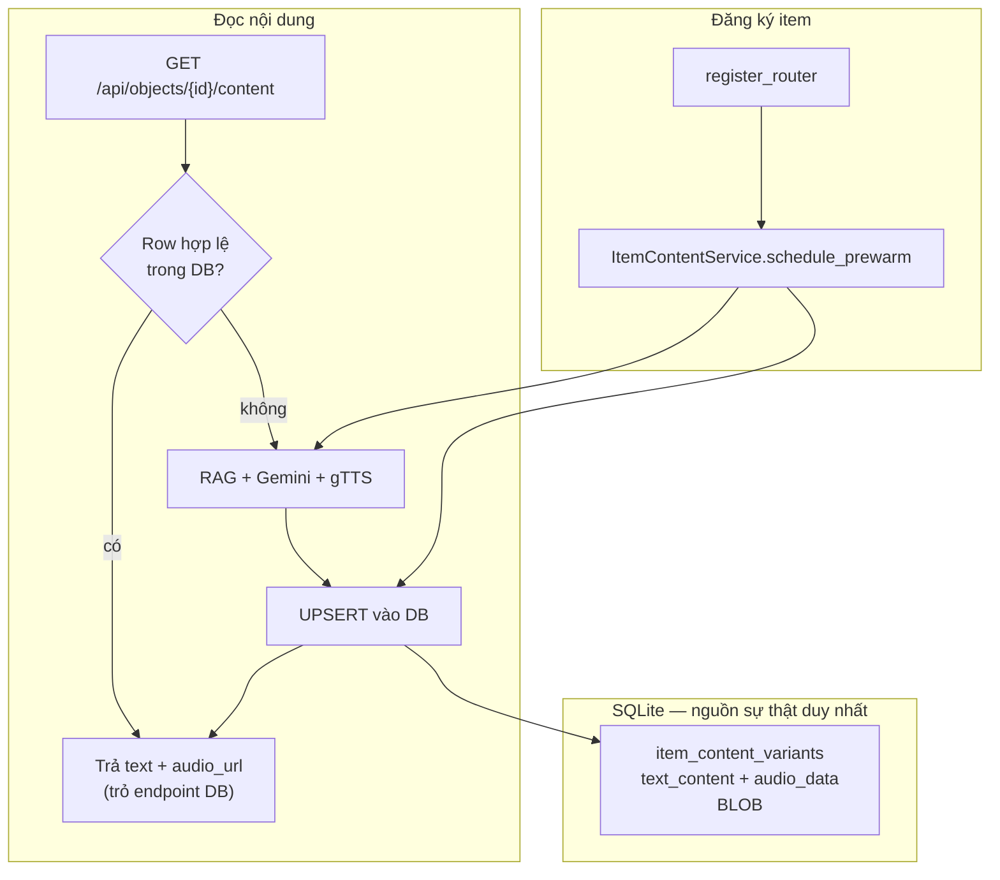

# Item Content Variants — Thiết Kế (Lưu Trong Database)

## Goal

Khi admin đăng ký vật thể lần đầu, hệ thống **tiền sinh** (pre-generate) bộ mô tả chi tiết theo từng **persona** và **ngôn ngữ**, gồm **text + audio** — và **lưu trực tiếp vào SQLite**, không dùng layer cache riêng hay file audio trên disk.

Khi visitor quét ảnh và mở trang hiện vật, API **đọc từ database trước**. Chỉ khi row chưa có (hoặc đã stale do đổi mô tả) mới chạy luồng RAG + Gemini + gTTS, rồi **ghi kết quả vào DB** để lần sau không gọi API nữa.

> **Nguyên tắc lưu trữ:** Text và audio là **dữ liệu chính thức của item**, không phải cache tạm. Một bảng DB duy nhất là nguồn sự thật (single source of truth).

## Bối Cảnh Hiện Tại

| Bước | Hành vi hiện tại |
|------|------------------|
| Đăng ký item | Lưu SQLite + embedding ảnh + upsert RAG (`item.description`) |
| Quét ảnh | `POST /api/search` → trả metadata → navigate `/item/{id}` |
| Trang item | `GET /api/objects/{id}` + `POST /api/generate` (RAG + Gemini mỗi lần) |
| Audio | `POST /api/tts` (gTTS) khi user bấm play — mỗi lần sinh mới |

Persona: `Mặc định`, `Gen Z Explorer`, `Family Visitor`.  
Ngôn ngữ: `Tiếng Việt`, `Tiếng Anh` (TTS map: `vi`, `en`).

## Phạm Vi

### In scope

- Lưu nội dung **story/display** (tương đương `/api/generate`) trong DB — **không cache chat**.
- Ma trận persona × language = **6 biến thể** / item.
- Cột `text_content` (TEXT) + `audio_data` (BLOB) + `audio_mime` trong cùng bảng.
- Pre-warm background khi đăng ký item.
- DB-first khi load trang item; generate-on-demand + persist khi thiếu row.
- Xóa / regenerate rows khi `description` item thay đổi.
- Endpoint stream audio từ BLOB DB (không lưu file `uploads/`).

### Out of scope

- Lưu câu trả lời chat trong DB.
- File audio trên filesystem.
- Layer cache in-memory / Redis.
- Streaming text.

---

## Kiến Trúc Tổng Quan



---

## Mô Hình Dữ Liệu

### Bảng `item_content_variants`

```sql
CREATE TABLE item_content_variants (
    id            INTEGER PRIMARY KEY AUTOINCREMENT,
    item_id       INTEGER NOT NULL REFERENCES items(id) ON DELETE CASCADE,
    persona       TEXT NOT NULL,       -- 'Mặc định' | 'Gen Z Explorer' | 'Family Visitor'
    language      TEXT NOT NULL,       -- 'Tiếng Việt' | 'Tiếng Anh'
    text_content  TEXT NOT NULL,
    audio_data    BLOB,                -- MP3 bytes từ gTTS; NULL nếu TTS lỗi
    audio_mime    TEXT,                -- 'audio/mpeg' khi có audio_data
    status        TEXT NOT NULL DEFAULT 'ready',
    -- 'ready' | 'generating' | 'failed'
    source        TEXT NOT NULL DEFAULT 'generated',
    -- 'pregenerated' | 'generated' | 'fallback_description'
    content_hash  TEXT NOT NULL,       -- SHA256(item.description) — invalidate khi mô tả đổi
    created_at    DATETIME NOT NULL DEFAULT CURRENT_TIMESTAMP,
    updated_at    DATETIME NOT NULL DEFAULT CURRENT_TIMESTAMP,
    UNIQUE (item_id, persona, language)
);
```

### SQLAlchemy

```python
class ItemContentVariant(Base):
    __tablename__ = "item_content_variants"

    id: Mapped[int] = mapped_column(Integer, primary_key=True)
    item_id: Mapped[int] = mapped_column(ForeignKey("items.id", ondelete="CASCADE"))
    persona: Mapped[str] = mapped_column(String(64))
    language: Mapped[str] = mapped_column(String(32))
    text_content: Mapped[str] = mapped_column(Text)
    audio_data: Mapped[bytes | None] = mapped_column(LargeBinary, nullable=True)
    audio_mime: Mapped[str | None] = mapped_column(String(64), nullable=True)
    status: Mapped[str] = mapped_column(String(32), default="ready")
    source: Mapped[str] = mapped_column(String(32), default="generated")
    content_hash: Mapped[str] = mapped_column(String(64))
    # ...
```

**Không có** cột `audio_path`, **không có** thư mục `uploads/{id}/audio/`.

### Kích thước ước tính

| Thành phần | / variant | × 6 variants | × 100 items |
|------------|-----------|--------------|-------------|
| Text | ~1–3 KB | ~18 KB | ~1.8 MB |
| Audio MP3 | ~50–200 KB | ~900 KB | ~90 MB |

SQLite chấp nhận BLOB lớn; với quy mô demo/museum (<500 items) hoàn toàn khả thi. Nếu sau này scale lớn có thể tách audio sang object storage — **ngoài phạm vi hiện tại**.

### `content_hash`

Chỉ hash `item.description` (không gồm persona/language). Khi đọc:

- Row tồn tại **và** `content_hash == hash(item.description)` → dùng DB.
- Hash lệch → xóa toàn bộ variants của item → regenerate.

---

## Module Backend

```
backend/app/modules/content/
  __init__.py
  models.py           # ItemContentVariant
  service.py          # ItemContentService
  router.py           # GET content + GET audio stream
  prewarm.py
  personas.py
```

### `ItemContentService` (không dùng tên "Cache")

| Method | Mô tả |
|--------|--------|
| `get_variant(db, item_id, persona, language)` | SELECT nếu hash khớp |
| `upsert_variant(db, ...)` | Ghi text + audio BLOB + metadata |
| `delete_variants_for_item(db, item_id)` | Xóa rows (khi update/delete item) |
| `generate_and_persist(db, item, persona, language)` | RAG → Gemini → gTTS → UPSERT |
| `schedule_prewarm(item_id)` | Background: 6 variant |

**`generate_and_persist`:**

1. Đặt `status='generating'` (optional, chống duplicate job).
2. `build_item_context(...)` + `get_rag_generator().generate_answer(...)`.
3. `gTTS` → `BytesIO` → `audio_data: bytes`, `audio_mime='audio/mpeg'`.
4. `upsert_variant(..., status='ready', source='generated'|'pregenerated')`.

Gemini lỗi → `text_content=item.description`, `audio_data=NULL`, `source='fallback_description'`.

---

## API

### `GET /api/objects/{item_id}/content`

Query: `persona`, `language` (mặc định như hiện tại).

Response JSON:

```json
{
  "item_id": 1,
  "persona": "Mặc định",
  "language": "Tiếng Việt",
  "content": "Nội dung mô tả chi tiết...",
  "has_audio": true,
  "audio_url": "/api/objects/1/content/audio?persona=M%E1%BA%B7c%20%C4%91%E1%BB%8Bnh&language=Ti%E1%BA%BFng%20Vi%E1%BB%87t",
  "stored": true,
  "source": "pregenerated"
}
```

| Field | Ý nghĩa |
|-------|---------|
| `stored: true` | Đọc từ DB, không gọi Gemini/TTS trong request này |
| `stored: false` | Vừa generate và đã ghi DB |
| `has_audio` | `audio_data IS NOT NULL` |
| `audio_url` | URL stream từ DB — **không phải file static** |

### `GET /api/objects/{item_id}/content/audio`

Query: `persona`, `language`.

- Đọc `audio_data` từ DB.
- Trả `StreamingResponse(audio_data, media_type=audio_mime)`.
- Header `Cache-Control: public, max-age=31536000, immutable` (nội dung gắn hash mô tả — an toàn cache browser).
- 404 nếu không có BLOB.

**Không trả base64 trong JSON** — giữ payload JSON nhẹ; audio tải qua endpoint riêng.

### Luồng đọc

```
GET /content
  → row + hash OK? → trả text + audio_url (stored=true)
  → thiếu/stale?   → generate_and_persist → trả (stored=false)
```

### Endpoint giữ tương thích

| Endpoint | Hành vi mới |
|----------|-------------|
| `POST /api/generate` | Delegate → `ItemContentService` (đọc/ghi DB) |
| `POST /api/tts` | Chỉ cho chat / text tùy ý; trang item **không** gọi |

---

## Luồng Chi Tiết

### 1. Đăng ký item

```
register_router (sau commit)
  └─ ItemContentService.schedule_prewarm(item.id)
       └─ loop 6 (persona, language):
            generate_and_persist → UPSERT audio_data BLOB
```

HTTP response không đợi prewarm xong.

### 2. Visitor quét ảnh

`POST /api/search` giữ nguyên → `/item/[id]` gọi `GET /content`.

Frontend phát audio:

```typescript
audioRef.src = resolveImageUrl(response.audio_url);
// → GET /api/objects/1/content/audio?... → stream từ SQLite BLOB
```

### 3. Cập nhật mô tả

```
delete_variants_for_item(item.id)
schedule_prewarm(item.id)
```

### 4. Xóa item

`ON DELETE CASCADE` xóa variants (kèm BLOB) — không cần dọn file.

### 5. Chat

Không lưu DB — `/api/chat` realtime như cũ.

---

## Frontend

### `api.ts`

- `getItemContent(itemId, persona, language)`
- Type: `{ content, has_audio, audio_url, stored, source }`

### `item/[id]/page.tsx`

| Trước | Sau |
|-------|-----|
| `generateContent()` | `getItemContent()` |
| `fetchTTSAudio(text)` → blob | `audio_url` stream từ DB |
| 2+ API calls | 1 JSON + 1 audio (lazy khi play cũng được) |

---

## Async & Concurrency

- Prewarm: `BackgroundTasks` (MVP) hoặc queue sau.
- Chống duplicate: `UNIQUE(item_id, persona, language)` + kiểm tra `status='generating'`.
- Nếu 2 request cùng miss: request thứ hai poll/wait hoặc regenerate idempotent (UPSERT).

Env:

- `CONTENT_PREWARM_ENABLED=true`
- `CONTENT_PREWARM_ALL_VARIANTS=true` (false = chỉ Mặc định + Vi)

---

## Xử Lý Lỗi

| Tình huống | Hành vi |
|------------|---------|
| Gemini fail | Lưu DB: text = `description`, `audio_data=NULL` |
| TTS fail | Lưu DB: text OK, `audio_data=NULL`, `has_audio=false` |
| Prewarm chưa xong | User mở trang → sync generate → ghi DB |
| RAG down | Context = description; vẫn persist kết quả Gemini |
| DB read OK | **Zero** external API |

---

## Test Plan

### Unit

- `upsert_variant` — text + BLOB round-trip
- Hash mismatch → coi như thiếu row
- `delete_variants_for_item`

### API

- `GET /content` — row có sẵn → mock Gemini **không** được gọi
- `GET /content` — thiếu row → generate → row xuất hiện trong DB
- `GET /content/audio` — trả `audio/mpeg`, bytes khớp BLOB đã lưu
- Update description → rows bị xóa/regen

---

## Kế Hoạch Triển Khai

### Phase 1 — DB + read path

- [ ] Model + migration `item_content_variants` (TEXT + BLOB)
- [ ] `ItemContentService.generate_and_persist`
- [ ] `GET /content` + `GET /content/audio`
- [ ] Frontend item page
- [ ] Tests

### Phase 2 — Prewarm

- [ ] Background prewarm on register / re-prewarm on update
- [ ] Status `generating` / logging

### Phase 3 — Dọn dẹp

- [ ] `POST /api/generate` delegate DB
- [ ] Admin `POST .../content/rebuild`
- [ ] (Tuỳ chọn) Search trả `content` + `audio_url` từ DB

---

## Rủi Ro

| Rủi ro | Mức | Giảm thiểu |
|--------|-----|------------|
| SQLite file phình (~90MB/100 items) | Trung bình | Chấp nhận demo; monitor `app.db` size |
| Prewarm tốn Gemini quota | Cao | Feature flag; prewarm từng bước |
| Stale nếu quên hash check | Cao | Mọi read đều verify `content_hash` |
| gTTS cần mạng lúc generate | Thấp | Chỉ lần đầu; sau đó phát từ BLOB |
| Concurrent UPSERT | Trung bình | UNIQUE + status lock |

---

## Non-Goals

- Không lưu chat trong DB.
- Không file audio trên disk.
- Không cache layer riêng (Redis/memory) — **DB là storage duy nhất cho text + audio**.
