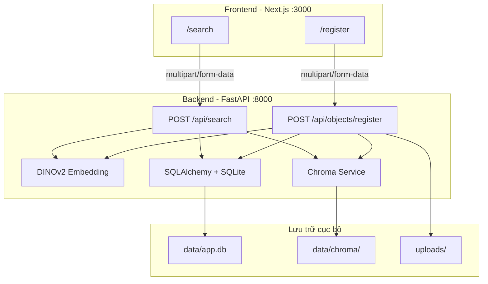
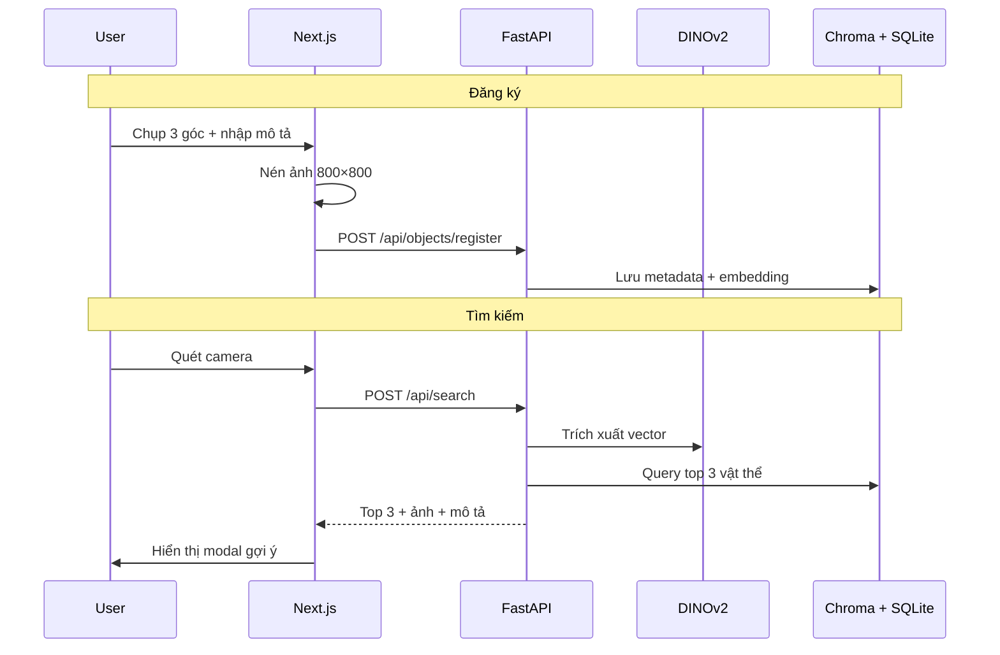

# DINOv2 Object Search

Hệ thống **tra cứu vật thể đa góc nhìn** (RAG hình ảnh): đăng ký vật thể từ nhiều ảnh, quét camera để tìm và hiển thị thông tin mô tả.

---

## Mục tiêu & Kế hoạch

| Thành phần | Mô tả |
|------------|-------|
| **Đăng ký** (`/register`) | Chụp/tải ảnh 3 góc (trước, bên, sau) + nhập tên & mô tả |
| **Tìm kiếm** (`/search`) | Quét camera, trả về **top 3 vật thể gần giống nhất** kèm ảnh |
| **AI Engine** | DINOv2 ViT-S/14 — vector 384 chiều, cosine similarity |
| **Vector DB** | Chroma — lưu embedding theo từng góc ảnh |
| **Metadata DB** | SQLite — lưu tên, mô tả, đường dẫn ảnh chính |



---

## Tech Stack

| Lớp | Công nghệ |
|-----|-----------|
| Frontend | Next.js 14 (App Router), TailwindCSS, TypeScript |
| Backend | FastAPI, Uvicorn, Python 3.10+ |
| AI | DINOv2 ViT-S/14 qua HuggingFace `facebook/dinov2-small` (384-dim) |
| Vector DB | Chroma (persistent, cosine similarity) |
| Metadata DB | SQLite |
| Docker + Tunnel | Docker local + Cloudflare Tunnel (khuyên dùng) |

---

## Cấu trúc thư mục

```
TestDinoV2/
├── backend/
│   ├── app/
│   │   ├── main.py              # FastAPI app, CORS, static files, lifespan
│   │   ├── config.py            # Biến môi trường
│   │   ├── models/
│   │   │   └── item.py          # SQLAlchemy model bảng items
│   │   ├── schemas/
│   │   │   ├── register.py      # RegisterResponse
│   │   │   └── search.py        # SearchResponse, SearchMatch
│   │   ├── routers/
│   │   │   ├── register.py      # POST /api/objects/register
│   │   │   └── search.py        # POST /api/search
│   │   └── services/
│   │       ├── embedding.py     # DINOv2: trích xuất vector + augmentation
│   │       ├── chroma.py        # Chroma: thêm/query embedding
│   │       ├── database.py      # SQLAlchemy session, init DB
│   │       └── storage.py       # Lưu file ảnh upload
│   ├── data/                    # SQLite + Chroma (gitignored)
│   ├── uploads/                 # Ảnh đã upload (gitignored)
│   ├── requirements.txt
│   ├── .env.example
│   ├── test_api.py              # Test API end-to-end
│   └── test_integration.py      # Test embedding + Chroma
│
├── frontend/
│   ├── app/
│   │   ├── layout.tsx           # Layout + navigation
│   │   ├── page.tsx             # Trang chủ
│   │   ├── register/page.tsx    # Đăng ký vật thể
│   │   └── search/page.tsx      # Quét tìm vật thể
│   ├── components/
│   │   ├── ImageUploadField.tsx # Input ảnh + camera
│   │   ├── ImagePreviewGrid.tsx # Lưới xem trước thumbnail
│   │   ├── CameraCapture.tsx    # Camera realtime + chụp
│   │   ├── LoadingOverlay.tsx   # Spinner radar khi tìm kiếm
│   │   └── ResultModal.tsx      # Modal top 3 kết quả + ảnh
│   ├── lib/
│   │   ├── api.ts               # Gọi REST API
│   │   └── imageCompress.ts     # Nén ảnh max 800×800 (client)
│   ├── next.config.mjs          # Proxy /api và /uploads → backend
│   ├── .env.local               # NEXT_PUBLIC_API_URL (để trống = dùng proxy)
│   └── package.json
│
├── scripts/
│   └── start-ngrok.ps1          # Khởi động ngrok tunnel frontend
│
├── .gitignore
└── README.md
```

---

## Database Schema

### SQLite — bảng `items`

```sql
CREATE TABLE items (
    id          INTEGER PRIMARY KEY AUTOINCREMENT,
    name        VARCHAR(255) NOT NULL,
    description TEXT NOT NULL,
    main_image_url TEXT,
    created_at  TIMESTAMP DEFAULT CURRENT_TIMESTAMP
);
```

### Chroma — collection `object_search_collection`

| Thuộc tính | Giá trị |
|------------|---------|
| Kích thước vector | 384 chiều |
| Khoảng cách | Cosine similarity |
| Metadata | `item_id` (int), `angle` (string) |
| ID document | `{item_id}_{angle}` — ví dụ `1_front`, `1_side_aug1` |

Mỗi ảnh đăng ký tạo nhiều vector: gốc + augmentation (lật ngang, crop giữa) để tăng khả năng khớp góc chụp khác nhau.

---

## API Endpoints

### `POST /api/objects/register`

**Input** (multipart/form-data):

| Field | Bắt buộc | Mô tả |
|-------|----------|-------|
| `name` | Có | Tên ngắn gọn |
| `description` | Có | Mô tả chi tiết |
| `main_image` | Có | Ảnh mặt trước |
| `side_image` | Không | Ảnh mặt bên |
| `back_image` | Không | Ảnh mặt sau |

**Response:** `{ "item_id": 1, "message": "success" }`

### `POST /api/search`

**Input:** `search_image` (file ảnh)

**Response:**

```json
{
  "found": true,
  "results": [
    {
      "item_id": 1,
      "name": "Bình nước xanh",
      "description": "Mô tả chi tiết...",
      "similarity": 0.8521,
      "image_url": "/uploads/1/front.jpg"
    }
  ],
  "message": null
}
```

- Trả về tối đa **3 vật thể** (`SEARCH_TOP_N`)
- `found: true` khi vật #1 vượt ngưỡng `SIMILARITY_THRESHOLD`
- Vẫn hiển thị top 3 dù chưa đủ tin cậy (chế độ gợi ý)

### `GET /health`

Health check: `{ "status": "ok" }`

### Swagger UI

http://localhost:8000/docs

---

## Thuật toán tìm kiếm

1. Ảnh query được **augment** (gốc, lật ngang, crop giữa) → nhiều vector
2. Query Chroma **top-K** vector gần nhất (`SEARCH_TOP_K=20`)
3. **Gộp theo `item_id`** — lấy similarity cao nhất mỗi vật
4. Sắp xếp, lấy **top 3** vật thể
5. Lấy metadata từ SQLite, trả về kèm `main_image_url`

---

## Cách chạy (Local)

### Yêu cầu

- Python 3.10+
- Node.js 18+
- Internet (lần đầu tải model DINOv2 ~80MB)

### Terminal 1 — Backend

```powershell
cd backend
pip install -r requirements.txt
copy .env.example .env
python -m uvicorn app.main:app --reload --port 8000
```

### Terminal 2 — Frontend

```powershell
cd frontend
npm install
npm run dev
```

### Truy cập

| URL | Mô tả |
|-----|-------|
| http://localhost:3000 | Giao diện web |
| http://localhost:8000/docs | API Swagger |
| http://localhost:8000/health | Health check |

Frontend proxy `/api/*` và `/uploads/*` sang backend qua `next.config.mjs` — không cần cấu hình CORS khi chạy local.

---

## Docker + Cloudflare Tunnel (khuyên dùng)

```powershell
.\scripts\start-docker.ps1              # Backend + Frontend trong Docker
.\scripts\start-cloudflare-tunnel.ps1   # Expose ra internet (HTTPS)
```

Chi tiết: [CLOUDFLARE_TUNNEL.md](CLOUDFLARE_TUNNEL.md)

---

## Cách chạy qua ngrok (thay thế)

```powershell
# 1. Cài authtoken (một lần)
ngrok config add-authtoken <TOKEN>

# 2. Terminal 1 — Backend
cd backend
python -m uvicorn app.main:app --reload --port 8000

# 3. Terminal 2 — Frontend
cd frontend
npm run dev

# 4. Terminal 3 — Ngrok (tunnel frontend port 3000)
cd ..
.\scripts\start-ngrok.ps1
```

Script in URL dạng `https://xxxx.ngrok-free.dev` — mở URL đó để dùng web từ bất kỳ đâu.

**Lưu ý ngrok free:**
- URL đổi mỗi lần chạy lại
- Máy bạn phải bật (backend + frontend + ngrok)
- Lần đầu có thể hiện trang cảnh báo → bấm **Visit Site**

---

## Cấu hình môi trường

### `backend/.env`

```env
DATABASE_URL=sqlite:///./data/app.db
CHROMA_PATH=./data/chroma
UPLOAD_DIR=./uploads
SIMILARITY_THRESHOLD=0.75    # Ngưỡng khớp (giảm = dễ tìm hơn, tăng = ít nhầm hơn)
SEARCH_TOP_K=20              # Số vector query từ Chroma
SEARCH_TOP_N=3               # Số vật thể trả về cho frontend
USE_AUGMENTATION=true        # Bật augmentation ảnh
CORS_ORIGINS=http://localhost:3000
CORS_ALLOW_ALL=true          # Bật khi dùng ngrok
```

### `frontend/.env.local`

```env
# Để trống = API đi qua Next.js proxy (khuyên dùng khi chạy local/ngrok)
NEXT_PUBLIC_API_URL=
```

---

## Chạy test

```powershell
cd backend
python test_integration.py   # Test embedding + Chroma
python test_api.py           # Test API register → search
```

---

## Luồng sử dụng



---

## Gợi ý tối ưu độ chính xác

1. **Đăng ký đủ 3 góc** ảnh, ánh sáng rõ, vật chiếm phần lớn khung hình
2. **Đăng ký lại** vật thể sau khi bật `USE_AUGMENTATION` (dữ liệu cũ thiếu vector augmentation)
3. Giảm `SIMILARITY_THRESHOLD` (ví dụ `0.70`) nếu vẫn khó tìm
4. Tăng `SEARCH_TOP_K` nếu có nhiều vật thể trong database
